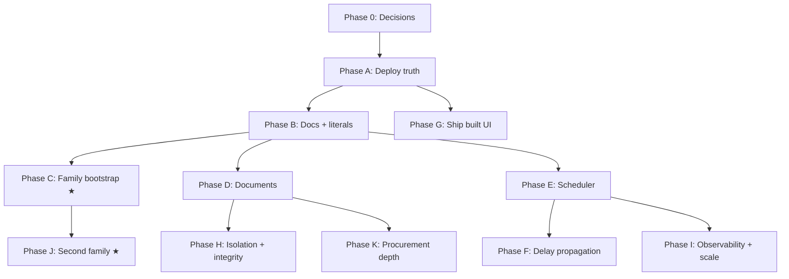

# 22 — DESPL MOS Consolidated Build Plan (Phase-wise)

**What this is:** every remaining work item found across blueprint documents `01`–`21`, itemized, sequenced, and made concrete enough for a developer to pick up. `18` gives the *reasoning* behind the phases; this document is the *backlog*.

**Effort key:** XS = hours · S = 1–3 days · M = 1–2 weeks · L = 2–4 weeks (one developer).
**Convention:** every item names the file/area it touches and its acceptance criterion, so "done" is not a matter of opinion.

---

## PHASE 0 — Close the decisions that gate the build
*Effort: a meeting. Blocks: H2, F5, K6, and the shape of several others.*

| # | Decision | Options | Recommended | Gates |
|---|---|---|---|---|
| 0.1 | Fabrication/assembly/spine join fix | (a) real FK (b) DB CHECK/trigger invariant | (b) now, (a) at the next migration window | H2 |
| 0.2 | Does `Project` become an entity above `Job`? | (a) keep `Job` as root (b) add `Project` | (a) — no evidence DESPL groups jobs this way | Domain model stability |
| 0.3 | Capacity constraints: hard gate or advisory? | (a) advisory flag (b) hard scheduling gate | (a) | F5 |
| 0.4 | Delay propagation: auto-apply or auto-suggest? | (a) suggest, human applies (b) auto below a threshold | (a) — keeps a named human accountable | F1–F3 |
| 0.5 | Formal `Team` model + manager hierarchy? | (a) keep dept + role + assignee (b) add `Team` | (a) — defer until org growth demands it | People model |
| 0.6 | Does Sales / pre-Job activity ever enter scope? | (a) MOS starts at `Job` (b) add lead/quote layer | (a) | Product boundary |
| 0.7 | Formal mid-execution cancellation state? | (a) defer (b) add `CANCELLED` now | (a) | Workflow states |
| 0.8 | Demo-first or MOS-thesis-first? | (a) ship visible UI first (G before C) (b) bootstrap first (C before G) | Depends on whether a management demo is imminent — **this reorders the whole plan** | Phase order |

---

## PHASE A — Establish deploy truth
*P0 · Effort: XS · Blocks: everything. Nothing below is trustworthy until this is done.*

| # | Item | Acceptance |
|---|---|---|
| A1 | Determine which branch Railway production actually deploys from | Written answer, confirmed in the Railway dashboard, not inferred from `railway.json` |
| A2 | Reconcile: merge `demo` → `main`, or repoint Railway at `demo` | The 77-commit divergence is zero, or the divergence is a recorded, deliberate decision |
| A3 | Verify `prisma migrate deploy` actually runs against the production DB (`railway.json` `deploy.preDeployCommand`) | A migration applied in the last deploy is visible in the production `_prisma_migrations` table |
| A4 | Confirm the full suite + lint pass on whichever branch becomes canonical | 571/571 pure tests, 0 lint errors, on the canonical branch |
| A5 | Decide whether a staging environment is created now or explicitly deferred in writing | CLAUDE.md's "no separate staging environment exists yet" is either fixed or acknowledged as accepted risk |

---

## PHASE B — Truth in documentation, and kill the literals
*P0/P1 · Effort: XS + S ≈ 1 week*

| # | Item | Touches | Acceptance |
|---|---|---|---|
| B1 | Correct CLAUDE.md invariant #2 — it claims material-dependency gating "is not implemented"; it is, at component-operation grain | `CLAUDE.md` | Text describes `assertKitReady`, its grain, and its no-op case |
| B2 | Remove PHASE-PROMPTS.md §0's false claim that Phase 0 removed the `workspace/page.tsx` literal | `docs/PHASE-PROMPTS.md` | Claim deleted or corrected to "open" |
| B3 | Remove the DESPL-320 fallback in `pilotJobId()` | `src/app/(app)/workspace/page.tsx:8–13` | No `?job=` param → job picker or most-recent-active job for the actor's tenant; no job-number literal remains |
| B4 | Remove `family: { code: "PRESSURE_VESSEL" }` from the durations query; take `familyId` as a parameter | `src/lib/services/admin.read.ts:63` | A PIPE_SPOOL admin can reach their own template's duration editor |
| B5 | Replace the `code: "FABRICATION"` department lookup with a configurable reference | `src/lib/services/welding.service.ts:24` | A tenant whose fabrication department uses a different code still gets weld logging |
| B6 | Replace `if (operationCode === "PAINTING")` with a declarative per-operation-type rule (e.g. an `OperationRef` flag) | `src/lib/services/component.service.ts` | The DFT rule is table-driven, not string-keyed |
| B7 | Delete the hardcoded 25-stage table; project `TemplateProcess.name` in `seq` order for the job's own `templateVersionId` | `src/lib/shared/stage-names.ts`, `workspace.read.ts` (`STAGE_COUNT = 25`) | A PIPE_SPOOL job renders its own stage labels and rollup |
| B8 | `<StageSpine />` accepts a route-derived stage array as props instead of assuming 25 | `src/components/**` | Component has no knowledge of any specific family |
| B9 | Consume `TemplateProcess.workOrderStages[]` crosswalk where a family defines one | read path | A family may opt out of the 25-stage reporting view entirely |
| B10 | Add a CI guard (lint rule or test) failing on `DESPL-320` / family / department code literals in `src/` | CI | The standing "no literal in `src/`" rule is machine-enforced, not honour-system |
| B11 | Record `specs.ts`'s per-family field map as a deliberate, accepted code-change point | ADR | Decision is documented rather than rediscovered as a gap each audit |

---

## PHASE C — Family / route / QCP self-serve bootstrap
*P1 · Effort: L · **This is the gate to calling the system a MOS.** Depends on: B4.*

| # | Item | Acceptance |
|---|---|---|
| C1 | `createProductFamily` service + admin UI | A family is created without touching `prisma/seed.ts` |
| C2 | Author a `ProcessTemplate` + first version from scratch (not only clone-from-family) | A family with no sibling to clone from can still get a template |
| C3 | `TemplateProcess` editor — add/edit/reorder, assign department, min/max duration, `provisional` flag | Route steps are authored in the UI |
| C4 | `TemplateEdge` editor — predecessor, edge type (`FINISH_TO_START` / `START_TO_START_WITH_OVERLAP`), `lagDays` | The DAG is authorable; `cpm.ts`'s existing cycle detection surfaces as a pre-publish validation error, not a runtime throw |
| C5 | Publish flow — completeness validation then version lock | `TEMPLATE_INCOMPLETE` / `TEMPLATE_VERSION_LOCKED` fire from the UI path, not just the service |
| C6 | `RouteTemplate` / `RouteTemplateVersion` / `RouteStep` authoring service + UI (per component type × family) | A component route is authored without `seed/component-routes.json` |
| C7 | `QcpTemplate` author-from-scratch — library row (`jobId: null`), `QcpItem` rows, P/W/H party codes, `QcpItemProcess` mapping by process code | A brand-new family's first QCP exists without hand-written JSON |
| C8 | Family readiness dashboard — per family, show template / route / QCP status and what blocks job creation | An admin can see at a glance why a family isn't orderable yet |
| C9 | Guard job intake against a family whose template version is not PUBLISHED | Refusal is explainable via an existing error code |
| C10 | Import/export a family config bundle as JSON | The seed-authored PRESSURE_VESSEL config and a UI-authored family share one shape; existing JSON is migratable |

---

## PHASE D — Document and file storage
*P1 · Effort: M–L · Can run in parallel with C.*

| # | Item | Acceptance |
|---|---|---|
| D1 | Select and provision an S3-compatible object store | Bucket reachable from the Railway environment |
| D2 | `Document` model + migration — `tenantId`, category, storage key, filename, mime, size, checksum, `uploadedBy`, `uploadedAt` | Migration applied forward-only |
| D3 | Entity links — job / equipment / unit / componentOperation / qcpExecution / drawingRevision / bomItem / ncr / dispatchBatch | A document is always reachable through a tenant-scoped parent |
| D4 | `DocumentCategoryRef` reference table (BOM, Drawing, MTC, Inspection report, QC evidence, NCR, Certificate, Photo, Dispatch doc) | A new category is a data insert, not a migration (principle 13) |
| D5 | Upload service — size/mime allowlist, audit log entry in the same transaction | Upload appears in `AuditLog` |
| D6 | Download service — permission inherited from the owning entity's scoping | A user who cannot see the parent cannot fetch the file |
| D7 | Revision handling reusing `DrawingRevision`'s supersede pattern | Superseded documents remain visible, never overwritten (invariant #6) |
| D8 | Upload UI wired into drawing revision, `QcpExecution`, MTC record, `Ncr`, `DispatchBatch` | A QC inspector can attach a certificate photo and retrieve it |
| D9 | Keep free-text refs (`mtcRef`, `poRef`, `wpsRef`, `jointRef`) but add an optional `documentId` link | Existing typed references keep working; new ones can point at a real file |
| D10 | MDR compilation — assemble a job's documents into a manifest/export | The DOCUMENTATION department gets its missing capability (currently scored 1/10) |

---

## PHASE E — Scheduled operating rhythm
*P2 · Effort: S–M · One piece of infrastructure closes three separate gaps.*

| # | Item | Acceptance |
|---|---|---|
| E1 | Add scheduler infrastructure (BullMQ + Redis, per CLAUDE.md's own named fallback, or Railway cron → protected route) | A job runs on a schedule with no human clicking anything |
| E2 | Daily digest delivered on schedule; keep the manual "Send now" as an override | The digest arrives without `publishDigest` being pressed |
| E3 | Move overdue-stage and aged-hold-point detection out of the per-page-load lazy scan into scheduled reconciliation | Alerts fire regardless of page traffic; the full-table scan leaves the request path |
| E4 | Wire `fileDelayReason` → notification | Filing a delay notifies the right people (today it notifies nobody) |
| E5 | Wire NCR open → notification | Opening an NCR notifies the right people (today it notifies nobody) |
| E6 | Replace scattered hardcoded alert-type string literals with a configurable rule/severity table | A new alert type is configuration, not a new call-site literal |
| E7 | Make `/alerts` a real page (currently a "coming in R2" stub) | No dead controls, per the team's own functional-first rule |
| E8 | Failed-job visibility for the queue | A silently failing background job is discoverable |

---

## PHASE F — Delay propagation and scheduling intelligence
*P3 · Effort: S–M · Depends on: 0.3, 0.4, E1.*

| # | Item | Acceptance |
|---|---|---|
| F1 | On `fileDelayReason`, compute the would-be cascading reschedule without committing it | Reuses the existing `applyDurationOverride` CPM path; no new scheduling maths |
| F2 | Surface it as a proposed reschedule with a diff — which downstream dates move, by how much, and the delivery-date impact | A Production Head sees consequences before deciding |
| F3 | One-click apply, preserving `OVERRIDE_REASON_REQUIRED` and the audit entry | The human approval survives; only the friction is removed |
| F4 | Delivery-risk signal on `Job` from recomputed finish vs. `committedDeliveryDate` | Portfolio risk stops depending on someone noticing a slip |
| F5 | *(if 0.3 = advisory)* Capacity-awareness pass — department headcount/shift capacity per day, flag overallocation | Overallocation is flagged, never silently reallocated |
| F6 | Wire the existing `DelayReviewStatus` enum into a review/acknowledgement workflow | A filed delay reason can be reviewed, not just recorded |

---

## PHASE G — Ship what is already built
*P3 (P1 if a demo is imminent — see 0.8) · Effort: M · Depends on: A.*

| # | Item | Acceptance |
|---|---|---|
| G1 | Dispatch UI — create batch, add units, approve release, record dispatch | The tested `dispatch.service.ts` becomes reachable by a human |
| G2 | Packing UI — `Package` creation, `assignUnitToPackage` | A unit can be packed through the UI |
| G3 | NCR UI — open, disposition, rework, close | The NCR state machine becomes operable |
| G4 | Paint / DFT UI — `PaintRecord`, `DftReading` entry | Paint records stop being service-layer-only |
| G5 | **Add the missing QC→dispatch gate** — refuse packing/dispatch of a unit with an open NCR or uncleared hold point | Gating runs both directions; today it only runs dispatch→process |
| G6 | Re-pin DESPL-320 (or the next real job) to the template version carrying the dispatch evidence requirement; run one unit end-to-end | Pack → release → dispatch completes on a real job |
| G7 | DFT acceptance range — spec'd micron min/max, validated instead of self-attested | A reading outside spec is refused, not accepted |
| G8 | QC witness (W) waiver — write `waiverApprovedBy` via a Production-Head approval action; add the missing `blocksCompletion` check | Invariant #4 becomes fully true, not half-true |
| G9 | Resume-from-hold restores the prior state instead of always landing on `IN_PROGRESS` | A unit held mid-QC returns to `SUBMITTED` |

---

## PHASE H — Isolation, integrity, and test depth
*P2 · Effort: M · Can run in parallel with C/D/E. Depends on: 0.1.*

| # | Item | Acceptance |
|---|---|---|
| H1 | Job-level RLS policy (or enforced views) backstopping the `jobId` filter convention | A deliberately-unfiltered query cannot read another job's rows |
| H2 | FK (or DB CHECK/trigger) for the `ComponentOperation`/`AssemblyStep` ↔ `JobProcess` numeric-code join; migration + backfill | A stage renumber fails loudly instead of silently breaking rollups |
| H3 | Widen `cross-tenant.test.ts` from 4 hand-picked entry points toward a systematic sweep | The suite stops being honestly-narrow and becomes broadly-safe |
| H4 | Add a named "Project A vs Project B" multi-job independence suite | Cross-job independence can't silently regress |
| H5 | Structural RBAC guard — wrapper or lint rule so a service function missing its `require*` call fails the build | A forgotten authorization check cannot ship |
| H6 | Security headers block in `next.config.ts` (CSP, HSTS, X-Frame-Options, Referrer-Policy) | Headers present in production responses |
| H7 | General-purpose rate limiting beyond login/password-change | Abuse of any mutation endpoint is bounded |
| H8 | BOM tree depth limit alongside the existing `BOM_CYCLE_DETECTED` guard | A pathological BOM cannot exhaust the recursion |

---

## PHASE I — Observability and scale
*P2 · Effort: S–M · Every item here is already named in the team's own code comments.*

| # | Item | Acceptance |
|---|---|---|
| I1 | Structured logging (request id, tenant id, actor id, error code) replacing the three raw `console.*` calls | A production error is diagnosable without reading the audit log |
| I2 | Error tracking (Sentry-equivalent) on server actions and service errors | Unhandled exceptions surface without a user reporting them |
| I3 | Fix the named N+1 in `jobs.read.ts` (3+ queries per job for hold-point counts and spine rollups) | Job list issues a bounded number of queries regardless of job count |
| I4 | Pagination (`take`/`skip`) on the list services: `jobs.read`, `portfolio.read`, `command-center.read`, `departments.read`, `myday.read`, `admin.read`, `gantt.read`, `job-intake.read`, `stage-detail.read`, `template.read` | No unbounded list query remains in a growth path |
| I5 | Batch the per-active-job loops in `myday.read.ts` and `command-center.read.ts` | The "fine at 3–40 jobs" comments stop being load-bearing |
| I6 | Performance budget assertion in CI for the main list endpoints | A regression is caught before it ships |

---

## PHASE J — Second family and management completeness
*P1 (J1–J3) / P3 (J4–J9) · Effort: M · Depends on: C.*

| # | Item | Acceptance |
|---|---|---|
| J1 | Author PIPE_SPOOL end-to-end through the Phase C UI — durations, QCP, publish | **Zero code changes required. That is the test.** |
| J2 | Create a real (or realistic pilot) Pipe Spool job; run intake → schedule → execute → QC → dispatch | A second family completes the full lifecycle |
| J3 | Run the multi-project acceptance test — a PV job and a Pipe Spool job concurrently | Independent workflows, schedules, BOMs, KPIs, alerts; no cross-contamination |
| J4 | Equipment-grain dashboard — current operation, progress, blocker, expected completion, risk | The one missing management grain (scored 0/10) exists |
| J5 | Portfolio additions — due-this-week / due-this-month, blocked-projects bucket, department-overload signal | Management questions answerable at portfolio grain, not only by drilling in |
| J6 | KPI framework consolidation — one shared, scope-parameterized function per metric shape, consumed by every read service | The 4× duplicated on-time-%/yield-% logic becomes one implementation |
| J7 | `Department.dashboardTier` field replacing the hardcoded `OFFICE_DEPT_CODES`/`ALL_DEPT_CODES` arrays | A 14th department gets its dashboard tier as data |
| J8 | Make `/board` a real page or remove it | No dead controls |
| J9 | Fix the 4 open cross-device P0s — sub-1024px routes via rail nav, desktop-only sign-out, QCP grid horizontal scroll, unguarded `oklch()`/`color-mix()` Safari floor | The shop floor can actually use it on the devices they have |

---

## PHASE K — Procurement and material depth
*P2 · Effort: M · Can run in parallel from Phase D onward.*

| # | Item | Acceptance |
|---|---|---|
| K1 | Vendor model (or vendor field on `ProcurementEvent`) — **none exists anywhere today** | "Who are we buying this from" is answerable |
| K2 | Expected-delivery-date on the PO event | **"Delayed" becomes computable — today it literally cannot be, for lack of a due date** |
| K3 | Lightweight `PurchaseOrder` model grouping events, preserving the append-only ledger (no second status enum to drift) | PO lifecycle visible without abandoning the event-sourced design |
| K4 | Required-by date at material level, derived from the consuming operation's scheduled start | Material lateness is measurable against production need, not just job delivery |
| K5 | Material shortage → procurement risk signal feeding the portfolio risk view | A material problem reaches management without someone reporting it |
| K6 | *(only if cross-job material pooling becomes real — decision)* Allocation/reservation model | Two jobs can share a stock pool without double-committing |
| K7 | Fix `assertKitReady`'s silent no-op — distinguish "no BOM link" (legitimate seam) from "never stocked" (should warn) | An untracked part stops passing the gate silently |
| K8 | BOM import — duplicate item-number detection (warn, don't block), multi-sheet selection, UoM canonicalization table, `componentTypeId` in the bulk schema | The four named ingestion gaps close without changing the partial-success philosophy |

---

## Dependency map

★ = the two phases that decide whether this is a MOS or a very good tracker.

## Parallelization

| Track | Phases | Who |
|---|---|---|
| Platform / data | A → H → I → K | Backend-leaning developer |
| Product / UI | B → C → J | Full-stack developer |
| Capability additions | D → E → F → G | Either, after B |

Two developers on the platform and product tracks compress the ~12–16 solo weeks to roughly **6–9 weeks**.

---

## If only ten things get done

1. A1 — find out which branch is actually deployed.
2. B1 + B2 — fix the two documentation claims that contradict the code.
3. B3, B4, B5, B7 — kill the four literals.
4. C1–C7 — family / route / QCP bootstrap UI.
5. D2–D8 — document storage, wired to QC and Engineering.
6. E1–E5 — scheduler, digest, and the two missing notification triggers.
7. G1, G5, G8 — dispatch UI, the missing QC→dispatch gate, and the witness-waiver approval.
8. H1 + H2 — job-level isolation backstop and the join integrity fix.
9. I1–I4 — logging, error tracking, the N+1, and pagination.
10. J1–J3 — Pipe Spool, authored with zero code changes.

That list is the difference between "a very well-built pressure-vessel tracker" and "DESPL MOS."
