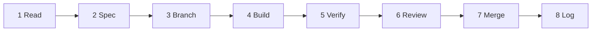

# 23 — DESPL MOS Execution Playbook

**What this is:** the operating manual for turning `22_DESPL_MOS_BUILD_PLAN.md` into shipped, verified code. `22` says *what* to build; this says *how the work runs* — branching, session protocol, definition of done, review gates, and change control.

**Who it's for:** whoever is at the keyboard, human or AI-assisted. This repo is built with AI coding sessions (per `CLAUDE.md`: *"Opus for architecture, specification and decisions. Sonnet for coding sessions"*), so §6 gives a reusable session prompt that carries the repo's own invariants into every task.

---

## 1. How to read a work item

Every item in `22` has the shape:

```
C4 | TemplateEdge editor — predecessor, edge type, lagDays | Acceptance: DAG is authorable;
     cpm.ts's cycle detection surfaces as a pre-publish validation error, not a runtime throw
```

- **ID (`C4`)** — the phase letter plus item number. Use it verbatim in branch names, commits, PR titles, and `progress.md`. One ID = one traceable unit of work, from plan to merged diff.
- **Statement** — what to build, in the repo's own vocabulary (model names, file paths).
- **Acceptance** — the objective test for "done." Not "the editor works" but "a cycle produces a validation error before publish." If you can't demonstrate the acceptance criterion, the item is not done, regardless of how much code exists.

**Rule:** never start an item whose acceptance criterion you can't picture yourself demonstrating. If it's vague, sharpen it first (§12) — that takes ten minutes and saves a rebuild.

---

## 2. Set up the board

Convert `22`'s ~90 items into whatever tracker the team actually uses (GitHub Issues is the least-friction choice here — the repo is already on GitHub with Actions CI). One issue per item, with these fields:

| Field | Value |
|---|---|
| Title | `[C4] TemplateEdge editor` |
| Labels | `phase:C`, `effort:M`, `priority:P1`, `track:product` |
| Body | The statement, the acceptance criterion, links to the relevant blueprint doc section (e.g. `07 §2`, `16 §2`) |
| Blocked by | Prerequisite item IDs from `22`'s dependency map |
| Milestone | The phase (`Phase C — Family bootstrap`) |

**Do this once, in one sitting, for all of Phases 0–C.** Phases D onward can be created as you approach them — but A, B, and C should be fully enumerated up front, because they are the critical path and their ordering matters.

**Two tracks, per `22`'s parallelization table.** Tag every issue `track:platform` (A → H → I → K) or `track:product` (B → C → J). If two people are working, they take one track each; the tracks were chosen to minimise file collisions. If one person is working, run the tracks strictly in sequence — do not interleave, because context-switching between a Prisma migration and a React editor is where mistakes get made in a codebase with this many invariants.

---

## 3. Branch and deploy discipline

### 3.1 First, fix the branch situation (Phase A)

Nothing below works while `demo` is 77 commits ahead of `main` and deploy configuration points at `main`. Resolve A1–A2 before opening a single feature branch. Pick one:

- **Option 1 (recommended):** merge `demo` → `main`, make `main` the deployed trunk, delete or freeze `demo`.
- **Option 2:** repoint Railway at `demo` and treat `demo` as trunk, updating `railway.json` and `CLAUDE.md` to say so.

Either is fine. **Continuing with two long-lived branches and an ambiguous deploy target is not** — it is the condition that let two weeks of work become invisible.

### 3.2 Per-item branching

```
feat/C4-template-edge-editor        # feature
fix/B3-workspace-pilot-fallback     # correction
chore/B1-claude-md-invariant-2      # docs/config
```

One branch per item ID. Branch from trunk, rebase on trunk before opening the PR. The repo already uses `git worktree` (`.worktrees/` is in the tree) — that's a good pattern for running two tracks in parallel without stashing, **but note the trap the team already hit**: an untracked `.worktrees/` directory got picked up by vitest and eslint, producing 165 phantom test failures and 410 phantom lint errors. That's fixed in `28d7f2f` — don't undo those exclude entries.

### 3.3 PR rules

- **One item per PR.** A PR that closes `B3` and `B4` is harder to revert and harder to review. The only exception is a set of XS documentation items (`B1` + `B2`) which can share one.
- **PR title:** `[C4] TemplateEdge editor`.
- **PR body must contain:** the acceptance criterion verbatim, how you demonstrated it, and the answer to the generality question (§10).
- **CI must be green** — GitHub Actions runs lint → typecheck → test (pure + DB-gated) → build. A red build is never merged "because it's unrelated."

---

## 4. The item lifecycle

Eight steps. Every item, every time.



1. **Read** — the item in `22`, plus the blueprint section it cites, plus the actual code it touches. For `C4` that's `22` Phase C, `07 §2` (workflow primitives), and `src/lib/schedule/cpm.ts` + `prisma/schema.prisma`'s `TemplateEdge`. Ten to thirty minutes. Skipping this is how someone rebuilds a mechanism that already exists.
2. **Spec** — fill the work-item card (§5). For XS/S items this is five lines. For M/L items it's a page, and it is worth writing before any code.
3. **Branch** — per §3.2.
4. **Build** — per §6 if AI-assisted, or straight coding if not. Stay inside the item's scope; adjacent improvements go in the backlog, not this diff.
5. **Verify** — per §7 and §8. Demonstrate the acceptance criterion. If it's a UI item, that means driving the real UI, not asserting a function returns.
6. **Review** — self-review the full diff first (`git diff trunk...HEAD`), then human review. The self-review pass catches most of what a reviewer would.
7. **Merge** — squash to one commit carrying the item ID. Trunk stays deployable.
8. **Log** — update `progress.md` (§11). Non-negotiable; it's the repo's own stated session discipline and it's what made the forensic audit possible.

---

## 5. Work-item card template

Copy this into the issue body before starting anything M or L.

```markdown
## [ID] Title

**Phase:** X · **Effort:** M · **Priority:** P1 · **Track:** product
**Blueprint refs:** 22 Phase X · 07 §2 · 16 §2

### Goal
One sentence. What is true after this that isn't true now?

### Files / areas touched
- prisma/schema.prisma (model X)
- src/lib/services/<name>.service.ts
- src/app/(app)/<route>/page.tsx

### Out of scope (explicitly)
- Things a reader might assume are included but aren't. Name them.

### Design notes
- Which existing pattern this follows (name the file that already does it this way)
- Which invariants apply (CLAUDE.md #N)
- Which error codes it must use (from src/lib/shared/errors.ts — reuse, don't invent)

### Acceptance criterion
Copied verbatim from 22. Plus how it will be demonstrated.

### Tests required
- [ ] Table-driven negative cases (if it touches state machine / gating / RBAC / audit)
- [ ] DB-gated test (if it touches schema or queries)
- [ ] E2E (if it's a user-facing flow)

### Generality check
"If we won an identical heat exchanger tomorrow, does this item's design require a code change?"
Answer must be **no**. If yes, say so before implementing.
```

---

## 6. The AI coding-session protocol

This repo is built through AI sessions. The single highest-leverage thing you can do is give every session the same framing, so the invariants don't have to be rediscovered each time.

### 6.1 Model choice
Per `CLAUDE.md`: **Opus for spec/architecture/decisions, Sonnet for coding sessions.** In practice: use the heavier model to fill the work-item card for an M/L item and to review a large diff; use the coding model for the build itself.

### 6.2 The session prompt template

```
Work item: [C4] TemplateEdge editor.

Read first, in this order:
1. docs/mos-blueprint/execution/22_DESPL_MOS_BUILD_PLAN.md — Phase C, item C4
2. docs/mos-blueprint/reference/07_DESPL_MOS_WORKFLOW_AND_ROUTING_MODEL.md §2
3. CLAUDE.md — the twelve invariants and the conventions section
4. docs/ADR-product-family-agnostic-platform-v1.md — the standing generality rule
5. The code: prisma/schema.prisma (TemplateEdge, TemplateProcess),
   src/lib/schedule/cpm.ts, src/lib/services/template.service.ts

Build ONLY item C4. Do not refactor adjacent code, do not "improve" things you
notice in passing — list those at the end instead, and I'll add them to the backlog.

Binding rules for this session:
- Business rules live in src/lib/services/. Server Actions are thin callers. No
  direct Prisma calls in src/app/actions/*.
- Validation schemas go in src/lib/shared/schemas.ts. There is one source of truth.
- Reuse an existing error code from src/lib/shared/errors.ts. Only invent a new one
  if nothing fits, and say so explicitly if you do.
- Prisma migrations are forward-only. Never edit an applied migration.
- No literal "DESPL-320", family code, or department code anywhere in src/.
- No client-supplied timestamps. Server clock only.
- Any change to state machine, gating, RBAC, or audit paths requires table-driven
  tests for the VIOLATION cases, not just the happy path.
- Never read AUTH_SECRET or mint a session to verify something. If you need an
  authenticated session, drive the real /login form through browser automation, or
  report verification as incomplete. An honestly-flagged gap is recoverable.

Acceptance criterion (this is the definition of done):
The DAG is authorable through the UI, and a cycle produces a pre-publish validation
error rather than a runtime throw from cpm.ts.

Stop condition:
If implementing this the way I've described would make the answer to "if we won an
identical heat exchanger tomorrow, what code changes?" anything other than "none",
STOP and tell me before writing code.

At the end, give me:
- A summary of the diff, file by file
- Which acceptance criterion you demonstrated, and how
- Anything you noticed but deliberately left alone
- A draft progress.md entry
```

### 6.3 Why this template is shaped this way

Each clause exists because of something already in this repo's history: the "read first" list because the mechanism usually already exists; the scope fence because unscoped sessions produce unreviewable diffs; the credential clause because that incident actually happened (16 Aug 2026, caught by a safety monitor, not by review); the stop condition because the ADR requires the generality test at every phase gate, and it is much cheaper before implementation than after.

---

## 7. Definition of Done

### 7.1 Per item
- [ ] Acceptance criterion demonstrated, not just asserted
- [ ] `pnpm lint && pnpm typecheck` clean
- [ ] `pnpm test` green (baseline: 571 pure tests)
- [ ] `pnpm test:db` green if the item touched schema or queries
- [ ] Tests added for violation cases if it touched state machine / gating / RBAC / audit
- [ ] No new literal (job number, family code, department code) in `src/`
- [ ] Generality question answered "none" in the PR body
- [ ] `progress.md` updated
- [ ] Reviewed by someone other than the person (or session) that wrote it

### 7.2 Per phase (phase-exit review)
- [ ] Every item in the phase is closed or explicitly deferred with a reason
- [ ] The phase's own acceptance criteria in `22` hold
- [ ] The generality gate re-run against the whole phase, not just item-by-item (§10)
- [ ] `21_DESPL_MOS_MATURITY_SCORECARD.md` scores updated to reflect reality
- [ ] Deployed to trunk and confirmed live (Phase A's answer tells you how to confirm)
- [ ] One paragraph in `progress.md` summarising what the phase changed about the system

### 7.3 Per release to DESPL users
- [ ] E2E suite passes
- [ ] The deliberate-violation demo still refuses correctly — try to start a gated stage, verify your own submission, complete with an open hold point. The demo to MD/CEO includes attempting violations and showing the refusals; that has to keep working.
- [ ] No dead controls (the repo's own functional-first rule)
- [ ] Migrations applied to production and verified in `_prisma_migrations`

---

## 8. Testing rules by item type

| Item type | Minimum bar |
|---|---|
| Schema change (D2, H1, H2, K1–K4) | Migration + DB-gated test proving the constraint actually refuses bad data. A CHECK constraint nobody tested is decoration. |
| Gating / state machine (G5, G8, G9) | Table-driven tests over **allowed and refused** transitions. Follow `gating.test.ts`'s existing shape. |
| RBAC (H5, any new mutation) | Negative test per role that must be refused. Follow `authz.test.ts`. |
| Read path / dashboard (J4, J5, I3, I4) | Assert shape and, for I3/I4, assert query count or page size — a performance fix with no test regresses silently. |
| UI (C1–C8, G1–G4) | E2E via Playwright driving the real flow. Not a unit test on a handler. |
| Documentation (B1, B2) | A reviewer confirms the text now matches the code. That's the whole test. |
| Literal removal (B3–B7) | The CI guard from B10 is the test. Build it early in Phase B so the rest of the phase is self-verifying. |

**Build B10 (the literal-detection CI guard) first within Phase B.** It converts the remaining Phase B items from "trust the developer" into "the build fails if it's wrong," and it protects the rule permanently afterwards.

---

## 9. Migration discipline

1. Forward-only. Never edit an applied migration — this is stated in `CLAUDE.md` and it is load-bearing given the append-only audit design.
2. One migration per work item where possible.
3. Any migration that adds a constraint to existing data needs a **backfill plan written before the migration**. `H2` (the join FK) is the sharp case: existing rows must satisfy the constraint before it's enforced, so the sequence is *backfill → verify zero violations → add constraint*, in separate steps.
4. Test migrations against `despl_test`, never `despl_demo` (the repo's own warning).
5. Confirm the migration actually ran in production — `railway.json`'s `deploy.preDeployCommand` is where that happens, and Phase A3 is where you verify it does.

---

## 10. The generality gate

The ADR's standing test, applied at three moments:

- **Before implementing** (in the work-item card, and in the AI session's stop condition)
- **In the PR body** — one line: *"Heat exchanger test: none."*
- **At phase exit** — re-asked against the phase as a whole, because individual items can each pass while their combination quietly bakes in an assumption.

> *"If we won an identical heat exchanger tomorrow, what code changes?"* The answer must be **none** — an engineer authors a `ProcessTemplate` version, a `RouteTemplate` set, and a `QcpTemplate` as data.

**Phase C's exit is when this stops being theoretical.** Right now the honest answer is "a developer writes JSON and runs a seed script." After Phase C it must be "none," and Phase J proves it by doing exactly that for Pipe Spool with zero code changes. If Phase J requires a code change, that is a Phase C defect, not a Phase J task — send it back.

---

## 11. Progress tracking, and keeping the blueprint alive

### 11.1 `progress.md` (every session)
The repo's existing discipline: what shipped, decisions made, blockers, next steps. Add the item ID to every entry so the log is greppable by plan item.

### 11.2 The blueprint documents
These are living documents, not a one-time artifact. Specifically:

- **`21` (scorecard)** — update the scores at every phase exit. This is the honest progress signal for management; a score that never moves means the phase didn't change reality.
- **`22` (build plan)** — tick items, add discovered items with new IDs (`C11`, `K9`), never silently drop one. If an item is abandoned, mark it abandoned with a reason.
- **`20` (decisions)** — when an open decision is closed, record the answer and the date. Decisions that stay open past the phase that needed them are a project risk, not a documentation gap.
- **`17` (gap matrix)** — a gap that closes gets struck through, not deleted, so the record of what was fixed survives.

### 11.3 Sync to the vault
`CLAUDE.md` names the Obsidian vault mirror (`SWAYAM OS/4_Projects/Client Work/DESPL/DESPL TRACKER/`) with `progress.md` as canonical. Keep that flow: update `progress.md`, then sync `CURRENT_STATUS.md` / `TASKS.md` / `CHANGELOG.md`, then run `link_vault.py` if doc files were added or renamed — which they now have been, twenty-three of them.

---

## 12. Change control — when an item reveals something new

This will happen, especially in Phase C. The rule:

| Situation | What to do |
|---|---|
| The item is bigger than its effort tag | Split it into `C4a`/`C4b` in `22`, don't silently let one item run three weeks |
| You discover a new gap while building | New item ID appended to the phase. Do **not** fix it inside the current diff |
| The item's design conflicts with an invariant | **Stop.** Raise it. An invariant losing to a feature is how the credibility of the whole system erodes |
| The acceptance criterion turns out to be wrong | Fix the criterion in `22` first, with a note, then build against the corrected one |
| An open decision from `20` blocks you | Escalate for a decision; don't guess and don't build both branches |

---

## 13. Weekly rhythm

- **Monday:** pick the week's items from the current phase, respecting the blocked-by graph. Aim for one M or three S items per developer-week — that's the realistic rate in a codebase with this much test and invariant discipline.
- **Daily:** standup against item IDs, not areas. "C4 in review, C5 blocked on C4" beats "working on templates."
- **Friday:** merge what's green, update `progress.md`, and — if a phase closed — run the phase-exit review (§7.2) and update `21`'s scores.
- **At each phase exit:** a 30-minute review against §7.2 before starting the next phase. Phases that bleed into each other are how a 12-week plan becomes a 30-week plan.

---

## 14. Worked example — `B7` (kill the 25-stage table)

**Read.** `22` Phase B item B7 · `07 §1` · the code: `src/lib/shared/stage-names.ts`, `src/lib/services/workspace.read.ts` (`STAGE_COUNT = 25`), the `<StageSpine />` component, and `TemplateProcess` in the schema.

**Spec.**
- *Goal:* the Stage Spine renders a job's actual route instead of a hardcoded pressure-vessel sequence.
- *Touches:* `stage-names.ts` (delete the map), `workspace.read.ts` (project `TemplateProcess.name` in `seq` order for the job's `templateVersionId`), `<StageSpine />` (accept stages as props).
- *Out of scope:* the `workOrderStages[]` crosswalk consumption — that's `B9`, a separate item.
- *Design note:* `TemplateProcess` already carries name and seq per family version. No schema change. This is a read-path and props change.
- *Acceptance:* a PIPE_SPOOL job renders its own stage labels and progress rollup; no `STAGE_COUNT` constant remains.
- *Tests:* read-path test asserting a non-PV job returns its own stage list; E2E asserting the spine renders for two different families.
- *Generality:* none. That's the point of the item.

**Branch.** `fix/B7-route-derived-stage-spine`.

**Build.** AI session using §6.2's template with B7 substituted.

**Verify.** Seed a PIPE_SPOOL job locally; load its job page; confirm its stages render and the count matches its template, not 25. Then load a PV job and confirm nothing regressed.

**Review.** Diff should be small — a deletion, a read-path change, a props change. If it's large, scope crept.

**Merge, log.** `progress.md`: *"[B7] Stage Spine now derives stages from the job's pinned template version; deleted the 25-name PV table and STAGE_COUNT. Verified against a PIPE_SPOOL job and a PV job."*

---

## 15. Worked example — `C3` + `C4` (template + edge editors)

The hardest pair in the plan. Notes specific to them:

- **Do `C3` fully before starting `C4`.** Processes must exist before edges between them can be authored. Attempting both in one session produces a diff nobody can review.
- **Reuse `/admin/templates`' existing clone flow as the pattern** — it already iterates families generically and offers "clone from another family." The new authoring flow lives beside it, not instead of it.
- **`C4`'s hard part is not the UI, it's validation.** `cpm.ts` throws on a cycle (Kahn's algorithm, by construction). Today that throw happens at schedule time. The item requires it to surface at *author* time, pre-publish. So: extract or call the cycle check as a pure validation function against the draft edge set, and render the offending path in the UI. Don't duplicate the cycle logic — call the existing one.
- **Respect `TEMPLATE_VERSION_LOCKED`.** A published version is immutable (invariant #9). Authoring always happens against a draft version; publish is a one-way transition. If the UI ever lets someone edit a published version, that's a P0 defect, not a UX nicety.
- **Provisional durations are a feature, not an omission.** `PIPE_SPOOL` has real routes with no confirmed durations, and `cpm.ts` correctly refuses to compute rather than guess (`SCHEDULE_DATA_MISSING`). The editor must let an author save a process *without* durations, flagged `provisional` — don't force a number and don't default to zero.
- **Acceptance for the pair:** an admin creates a family, authors its processes and edges, hits a deliberate cycle and sees a clear validation error naming the cycle, fixes it, publishes, and creates a job against the published version — all without a developer.

---

## 16. Stop conditions

Stop and escalate rather than proceeding, in these cases:

1. An item's implementation would require weakening an invariant.
2. The generality test's answer would become anything other than "none."
3. An open decision in `20` genuinely blocks the design.
4. A migration would need to modify or reverse an applied one.
5. Verification requires an authenticated session and no browser automation is available — report incomplete rather than reaching for a credential shortcut.
6. The item turns out to be M or L when tagged S, and the difference is architectural rather than just more typing.

Every one of these is cheap to raise and expensive to discover after merge.

---

## 17. Failure modes to avoid

- **Phase-hopping.** Starting Phase C before Phase B's literals are closed means building new admin UI on top of `admin.read.ts`'s PRESSURE_VESSEL query — you'll build the wall and then have to knock it down.
- **Building the mechanism again.** This codebase's recurring shape is that the mechanism exists and the tooling doesn't. Before writing a service function, grep for it. `assertKitReady` existed for a day while the docs said material gating wasn't implemented.
- **Treating "the service layer is tested" as "shipped."** Dispatch has been fully tested and completely unusable for weeks. An item is done when a human can do the thing.
- **Letting `progress.md` slide.** The audit that produced this blueprint was possible because that file existed and was honest. Two weeks of undocumented sessions and that stops being true.
- **Quietly widening a diff.** The scope fence in §6.2 exists because unreviewable diffs are where invariant violations hide.
- **Marking an item done without demonstrating the acceptance criterion.** This is the one that compounds — it's how a plan reports 60% complete and delivers 30%.
