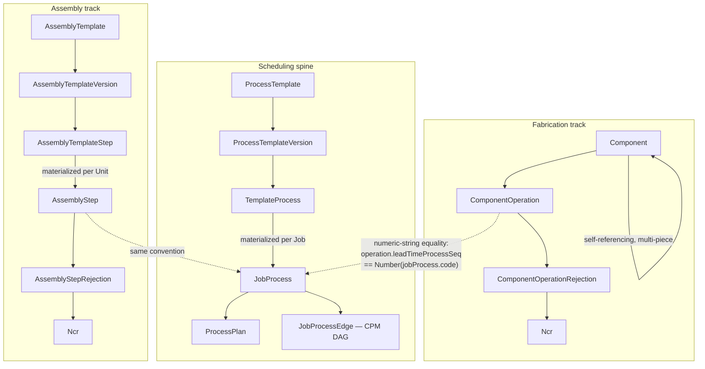
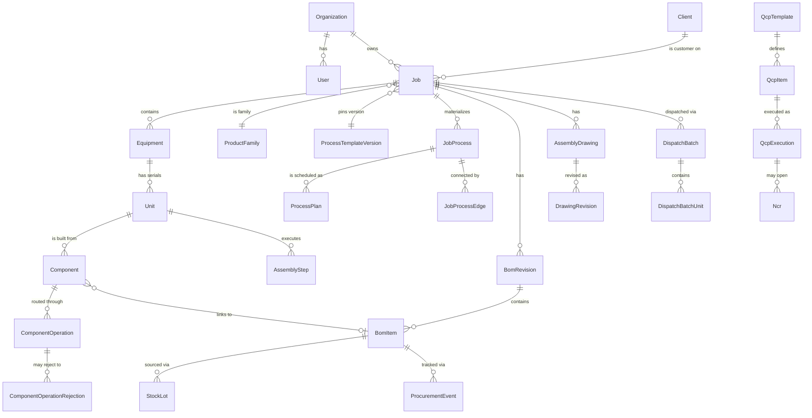

# 03 — DESPL MOS Domain Model

## 1. It is not a single linear chain

The brief proposed evaluating `Organization → Project → Job → Equipment → Assembly/Component → Operation → Task → Execution Event`. Verified against `prisma/schema.prisma` (71 models, 25 enums) and the service layer, **this is not correct as a single chain** — the real model is a `Job` root with **three coexisting, independently evolving tracks**, reconciled by a shared numeric code rather than a foreign key. This is the single most important domain finding in this blueprint, and it is a **`GAP`** (an architectural risk), not a design to imitate going forward.

**`CURRENT`, verified directly** (`src/lib/services/_shared.ts:462-496`, `loadMappedOps`): the join between execution grain (`ComponentOperation`/`AssemblyStep`) and schedule grain (`JobProcess`) is `operation.leadTimeProcessSeq == Number(jobProcess.code)` — string-parsed to a number, matched by *value*, with no foreign key or database constraint enforcing the match. The code comment at `_shared.ts:462` is explicit that this is "the same discipline `bom.read.ts`'s QCP-checkpoint lookup already uses."

**`GAP` (carried into `17` as a named finding):** a future renumbering of stage codes would silently break this join with no referential-integrity error to catch it. This is `43`-equivalent in the forensic audit's own "what should be refactored" list, and this blueprint concurs it is a **REFACTOR**, not a REBUILD (see `17` PRESERVE/REFACTOR/EXTEND/REBUILD classification).

## 2. Entity relationship map (verified against schema.prisma)

This is a simplified projection — the full 71-model schema is enumerated in `15_DESPL_MOS_DATA_ARCHITECTURE.md`.

## 3. Reference-table-not-enum pattern (preserve)

**`CURRENT`, verified and a genuine strength:** anything domain-vocabulary-shaped is a tenant-scoped reference table, not a hardcoded enum: `ComponentTypeRef`, `OperationRef`, `DrawingTypeRef`, `DelayCategoryRef`, `QcpCodeRef`, `Department` — all `@@unique([tenantId, code])`. This is exactly the mechanism a MOS needs (a new department, operation type, or delay category is a data insert, not a migration) and this blueprint's `TARGET` architecture preserves it unchanged.

Contrast: true enums are used for genuine finite state machines — `ProcessPlanStatus`, `NcrStatus`, `TemplateStatus`, `OperationStatus` — which is the correct boundary (state machines are enums; open vocabularies are reference tables). No anti-pattern found here.

## 4. What has no soft-delete, and why that's a coherent (not missing) choice

**`CURRENT`, verified:** zero `deletedAt` fields across all 71 models. Lifecycle is expressed via status enums instead. `createdAt` exists on only 12 of 71 models, `updatedAt` on exactly one. The team's substitute is two centralized append-only ledgers, `AuditLog` and `DomainEvent`, both DB-grant-enforced append-only (verified: `UPDATE`/`DELETE` explicitly revoked at the SQL grant level, not just application convention). **This blueprint's position: preserve.** "When was this row last touched" being unanswerable by querying most tables directly is a real tradeoff, but replacing it with per-table `updatedAt` timestamps would be additive, not a redesign — see `17`, low priority.

## 5. Job-level isolation: the one real structural gap in the data model

**`CURRENT`, verified:** only 27 of 71 models carry `tenantId` directly; the other 44 rely entirely on being reached through a `Job`/`Equipment` FK chain, consistent with `_shared.ts`'s parent-join pattern (`assertKitReady` reaches `BomItem` via `equipment: { job: { tenantId } }`, not a direct tenant column). Tenant isolation itself is DB-enforced (`withTenant`'s `set_config('app.tenant_id', ...)` + RLS, fail-closed — verified in `src/lib/db.ts`). **`GAP`:** *job-to-job* isolation within the same tenant has **no schema-level or RLS enforcement at all** — it rests entirely on every service function remembering to filter by `jobId` through the correct join chain. This was independently verified as consistently applied in every file sampled (including `admin.read.ts`'s explicit comment about `ProcessPlan` carrying no `tenantId` of its own), but it is **application discipline, not a database guarantee**. This is `17`'s highest-severity data-architecture gap after the family-bootstrap gap.

## 6. Domain boundary summary

| Track | Owns | Root entity | Versioned? |
|---|---|---|---|
| Fabrication | Physical component build, weld/NDT records | `Component` | No (operations aren't versioned; the route that spawned them is) |
| Assembly | Multi-component build-up per serial | `Unit` | Yes — `AssemblyTemplateVersion` |
| Scheduling spine | Department-owned process sequence, CPM dates | `Job` | Yes — `ProcessTemplateVersion` |
| Quality | Inspection, hold points, NCR/rework | `QcpTemplate`/`Ncr` | Yes — `QcpTemplate` (cloned, not versioned in place) |
| Material | BOM, stock, procurement | `BomRevision` | Yes — revision-numbered |

**`TARGET` decision this blueprint recommends (see `20`):** the reconciliation-by-numeric-code join (§1) should gain either a real foreign key (`ComponentOperation`/`AssemblyStep` → `JobProcess` directly) or, at minimum, a database CHECK/trigger-backed invariant that fails loudly on mismatch, before any future stage-renumbering work. This is scoped as a migration + backfill, not a redesign of the three-track model itself — the three tracks existing independently is a *reasonable* modeling choice (fabrication, assembly, and scheduling genuinely are different concerns with different grains), and this blueprint does not recommend collapsing them.

---
*Sources: `prisma/schema.prisma` (full model/enum grep), `src/lib/services/_shared.ts`, `docs/DESPL_MOS_FORENSIC_AUDIT.md` §6, §7, §26.*
