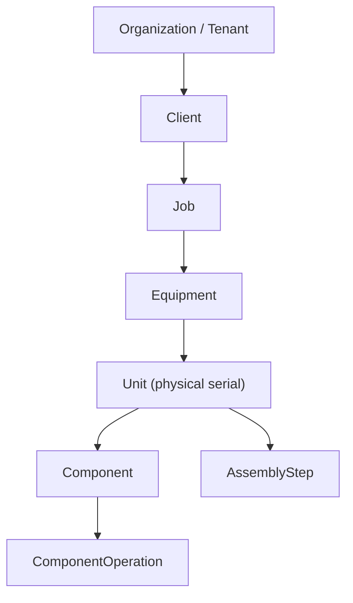

# 05 — DESPL MOS Project / Job / Equipment Model

## 1. The verified hierarchy

**`CURRENT`, verified real and multi-instance:** `Job.familyId → ProductFamily`, `Equipment.jobId → Job`, `Unit.equipmentId → Equipment`. A `Unit` is one physical serial — the schema's own comment gives DE0463 as "40 units of one equipment." Multiple jobs, multiple equipment per job, and multiple units per equipment are all structurally supported and already exercised by the two real jobs in seed data (DESPL-320; DE0467/DE0463).

## 2. Entity definitions — what each level represents, and why it exists

### PROJECT
There is **no separate `Project` model in the schema.** "Project" in conversation and in the brief maps directly onto `Job` — the ADR states this explicitly: *"A project in this system is a `Job`."* **`DECISION REQUIRED` (`20`):** should a `Project` entity be introduced above `Job` to group multiple jobs under one client engagement (e.g., a single PO spawning three separate equipment jobs), or does `Job` remain the top-level unit indefinitely? Current evidence: nothing in the schema, seed data, or docs suggests DESPL groups jobs this way today — recommendation is **no new entity**, treat `Job` as the project root, revisit only if a real multi-job client engagement surfaces.

### JOB
Why it exists: the unit of intake, scheduling, and commercial commitment. Carries `jobNumber`, `clientId`, `familyId`, `templateVersionId`, `priority` (`JobPriority` enum), `status` (`JobStatus` enum), `committedDeliveryDate`, `targetDispatchDate`. A `Job` pins exactly one `ProcessTemplateVersion` for its entire life (immutable-once-published — invariant #9), which is what makes "what schedule/gating rules apply to this job" a stable, auditable fact rather than a moving target.

### EQUIPMENT
What it represents: one distinct piece of equipment being built under a job (a job can span multiple equipment types/tags, e.g., two different vessel designs on one PO). `EquipmentTypeRef.familyId` ties equipment type to family; `EquipmentTypeRef.defaultSpecs` (JSON) seeds `Job.specs` at intake — **explicitly display/reference-only, never read by scheduling or gating** (schema comment invoking invariant #12: "the moment a schedule depends on a free-shaped blob, refusals stop being explainable"). This is a deliberate, correct boundary this blueprint preserves.

### UNIT
What it represents: one physical serial of an `Equipment` — the actual traceable, dispatchable object. This is the grain at which `Component`/`AssemblyStep` execution happens and the grain at which `DispatchBatchUnit` operates.

### OPERATION
Two distinct meanings exist in the codebase and must not be conflated (this is itself a finding, not an assumption):
1. **`OperationRef`** — a reference-table vocabulary entry (e.g., "PAINTING," "CUTTING") used by `RouteTemplate`/`RouteStep` to define what a component's route consists of.
2. **`ComponentOperation`** — the materialized, executable instance of a route step against a real `Component`, carrying `qtyPlanned/qtyGood/qtyRejected`, maker-checker state, and evidence.

The scheduling spine's equivalent unit is `JobProcess`/`ProcessPlan` (department-owned, DAG-connected) — **not the same entity as `ComponentOperation`**, reconciled only by the numeric-code join documented in `03`.

### TASK
No first-class `Task` model exists separately from `ComponentOperation`/`AssemblyStep`/`ProcessPlan`. "Task" in MOS-core vocabulary (`02`) refers to whichever of these three a given user role interacts with — a floor operator's task is a `ComponentOperation`/`AssemblyStep`; a department head's task is a `ProcessPlan`. **`DECISION REQUIRED` (`20`):** should a unifying `Task` view/model be introduced so "what do I have to do today" (`myday.read.ts`) doesn't need to reach into three different tables? Current evidence: `myday.read.ts` already does this successfully as a read-model projection without a new table — recommendation is **no new entity**, keep `Task` as a read-model concept (already proven), not a new write-path table, to avoid adding a fourth track to reconcile against the three already documented in `03`.

### EXECUTION EVENT
Represented by `DomainEvent` (append-only) plus the specific state-transition timestamps each execution model carries (`ComponentOperation.startedAt/submittedAt/verifiedAt`, etc.) — server-stamped only, never client-supplied (invariant #1, verified: no request DTO carries an `actual_*` field).

## 3. Preventing overlapping concepts — the disambiguation table

| Term | Model | Grain | Who touches it |
|---|---|---|---|
| Project (colloquial) | `Job` | Commercial commitment | PROJECTS, Management |
| Job (colloquial "unit of work") | `Job` | Same as above — no separate model | Everyone |
| Equipment | `Equipment` | One design/tag under a job | ENGINEERING, PLANNING |
| Serial | `Unit` | One physical, traceable, dispatchable object | Everyone downstream of intake |
| Route step (definition) | `RouteStep`/`OperationRef` | Template-time | ENGINEERING/admin (template authoring) |
| Operation (execution) | `ComponentOperation` | Per-component, per-unit | FABRICATION_PREP → DISPATCH floor departments |
| Assembly step (execution) | `AssemblyStep` | Per-unit | Assembly-track departments |
| Process (schedule) | `JobProcess`/`ProcessPlan` | Per-job, department-owned, DAG node | PLANNING, every department's command center |
| Task (read-model only) | Projection over the three execution models | Per-user, per-day | Floor operators, supervisors |

## 4. Ownership, lifecycle, identifiers, status, auditability

| Entity | Owner (department) | Lifecycle | Identifier | Status source | Auditability |
|---|---|---|---|---|---|
| `Job` | PROJECTS | Created at intake, closes at dispatch completion | `jobNumber` (business key) + `id` | `JobStatus` enum | `AuditLog` on every mutation (verified 78 call sites) |
| `Equipment` | ENGINEERING/PLANNING | Created at intake, immutable structure thereafter | `id`, tag | Derived from constituent units | Same |
| `Unit` | Production | Created at intake or equipment expansion, closes at dispatch | Serial number | Derived from constituent operations | Same |
| `JobProcess`/`ProcessPlan` | Owning department | Materialized from template at intake; superseded (not deleted) on reschedule | `code` (numeric string, process sequence) | `ProcessPlanStatus` enum, 5 discrete states | Same, plus `ScheduleRun.isCurrent` for baseline history |
| `ComponentOperation` | Floor department | Materialized from `RouteStep`; row-locked during transitions | `id` | `OperationStatus` enum | Same |

## 5. `TARGET`: no structural change recommended

This blueprint's conclusion, after verifying the brief's proposed hierarchy against the real schema: **the actual hierarchy is correct and should be preserved**, with two clarifications rather than new entities — (a) "Project" is a naming convention over `Job`, not a missing model; (b) "Task" is a read-model projection, not a missing table. The one real structural risk in this area is the numeric-code join documented in `03` §1/§5, which is a data-integrity fix, not a hierarchy redesign.

---
*Sources: `prisma/schema.prisma` (`Job`, `Equipment`, `Unit`, `Component`, `JobProcess`, `ProcessPlan` model definitions), `docs/ADR-product-family-agnostic-platform-v1.md`, `src/lib/services/myday.read.ts`, `docs/DESPL_MOS_FORENSIC_AUDIT.md` §7, §13.*
