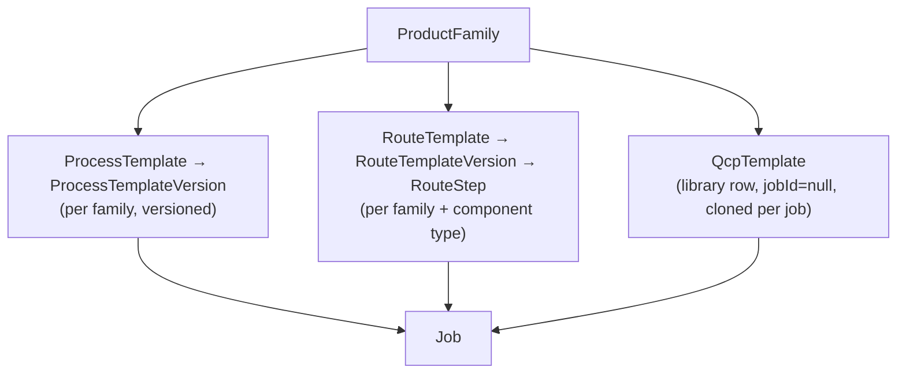

# 06 — DESPL MOS Product Family Model

This is the audit's — and this blueprint's — central question: **is the product-family mechanism real, or is it schema decoration on a pressure-vessel application?** Verified answer: **substantially real, partially bootstrapped.**

## 1. The verified model

This is close to, but not identical to, the brief's proposed `ProductFamily → ProductFamilyVersion → ProcessTemplate → RouteTemplate → QCPTemplate → Job` chain. **Correction, verified against schema:** there is no separate `ProductFamilyVersion` model — `ProductFamily` itself is not versioned; versioning lives one level down, on `ProcessTemplateVersion` and `RouteTemplateVersion` independently. This is the correct design (a family itself — "PRESSURE_VESSEL" as a concept — doesn't need versions; its *templates* do, and they version independently of each other) and this blueprint does not recommend adding a `ProductFamilyVersion` entity.

## 2. What is genuinely family-agnostic today (`CURRENT`)

- **Job intake, scheduling, gating, production tracking, QC** are fully data-driven off `familyId`/`templateVersionId` with **no family branching found anywhere in the service layer** (verified by direct inspection of `gating.ts`, `cpm.ts`, `job-intake.service.ts`).
- **Process-route authoring has a real admin UI** (`/admin/templates`) that iterates families generically and explicitly offers "Clone one from another family" for any family with no route yet.
- **Equipment-type catalog management** (`admin.service.ts`) takes an arbitrary `familyId`.
- **`Department` is data, not an enum** — a 14th department (or a family-specific one) is one INSERT.
- **`RouteTemplate` is explicitly nullable-family-scoped**: `@@unique([tenantId, componentTypeId, familyId])` with `familyId Int?`, confirmed directly in schema.

## 3. What still requires a developer (`GAP` — the actual MOS gate)

| Artifact | Who can create it today | Mechanism |
|---|---|---|
| `ProductFamily` itself | **Nobody through the app** | Only `prisma/seed.ts` — zero UI, zero Server Action found |
| `RouteTemplate` (component-level operation routes) | **Nobody through the app** | Only `prisma/seed.ts` from `seed/component-routes.json` — zero service function found |
| A first `QcpTemplate` for a brand-new family | **Nobody, from scratch** | `cloneQcpTemplate` can only copy an *existing* QCP; there is no author-from-nothing path except hand-writing JSON and running a seed script |
| Per-family intake spec fields (`specs.ts`) | **A developer, by design** | Hardcoded `Record<string, SpecField[]>` with only `PRESSURE_VESSEL` defined; the file's own comment accepts this as "a code change anyway" |
| The `/admin` standard-durations screen | **Nobody for a non-PRESSURE_VESSEL family** | `admin.read.ts:63` hardcodes `family: { code: "PRESSURE_VESSEL" }` in its query — a PIPE_SPOOL admin cannot reach their own template's duration editor through this screen at all, verified directly |

The ADR itself names this "the honest gap," and this blueprint independently confirms it by grep: zero service functions and zero UI routes create a `ProductFamily`, a `RouteTemplate`, or an initial `QcpTemplate`.

## 4. Family readiness today (verified)

| Family | Route status | Durations | Notes |
|---|---|---|---|
| `PRESSURE_VESSEL` | Published, 36-process template | Confirmed | DESPL-320 pinned to it; complete |
| `PIPE_SPOOL` | Real route exists | **Provisional** — no confirmed durations | Correctly flagged via a `TemplateProcess.provisional` boolean rather than guessed; `cpm.ts`'s `resolveDuration` throws `SCHEDULE_DATA_MISSING` rather than fabricate a number when `provisional` — a genuinely good instinct, verified in code |
| `PIPING_SYSTEM` | No template | — | — |
| `HEAT_EXCHANGER` | No template | — | — |

This is fairly characterized as **a data gap sitting on top of a real mechanism**, not a fake mechanism.

## 5. On "is this the right level of abstraction" (the brief's own worry, §59)

Verified evidence favors the team's judgment, not the worry:

- `specs.ts`'s header comment explicitly rejects an EAV (entity-attribute-value) table in favor of a plain typed map, reasoning that full configurability "would buy configurability nobody could safely use."
- `Job.specs` is explicitly walled off from the scheduling/gating path by a schema-level comment invoking invariant #12 — display/reference data can never silently become a scheduling input.
- Reference tables (not enums) are used exactly where an open vocabulary is needed, and enums are used exactly where a closed state machine is needed (`03` §3).

**`TARGET` conclusion:** the codebase is actively resisting over-abstraction, not reaching for it. The actual risk runs the other way — missing configurability at three specific, narrow points (§3 above) — which the forensic audit correctly names as the healthier failure mode of the two the brief warned against. This blueprint's roadmap (`18`) treats closing those three points as the highest-priority MOS-capability work, not as a sign the abstraction level is wrong.

## 6. Template governance — versioning rules

- **Template**: a reusable process definition (`ProcessTemplate`/`RouteTemplate`), scoped by tenant (+ family, + component type for routes).
- **Template Version**: an immutable revision (`ProcessTemplateVersion`/`RouteTemplateVersion`). Editing creates a new version row (invariant #9) — never mutates a published one.
- **Job Snapshot**: the exact configuration a job is pinned to. A `Job.templateVersionId` fixes the process spine for that job's entire life; a `Job.qcpTemplateSourceId`-cloned QCP is a job-owned copy, matched by process **code** (not id) specifically so the clone survives later template renumbering (verified: ADR's own table, row 4).

**Why this matters (verified, not assumed):** changing a published template must never silently change an already-running job's dates or gates. This is real and enforced — `TEMPLATE_VERSION_LOCKED`/`TEMPLATE_VERSION_NOT_PUBLISHED` are live error codes (`errors.ts`), and `ScheduleRun.isCurrent` preserves superseded baselines rather than deleting them on reschedule.

## 7. Second-family validation strategy (feeds `19`)

`PIPE_SPOOL` is the closest candidate to prove the family-bootstrap mechanism for real — a route already exists, only durations and a QCP are missing. This blueprint recommends `PIPE_SPOOL` as the second-family pilot once the bootstrap UI (§3's gap) exists, rather than jumping straight to `HEAT_EXCHANGER` (no template at all, would conflate "does the mechanism work" with "did we author enough data").

---
*Sources: `docs/ADR-product-family-agnostic-platform-v1.md` (verified line-by-line against schema), `src/lib/shared/specs.ts`, `src/lib/services/admin.read.ts`, `src/lib/schedule/cpm.ts`, `prisma/schema.prisma`, `docs/DESPL_MOS_FORENSIC_AUDIT.md` §8.*
