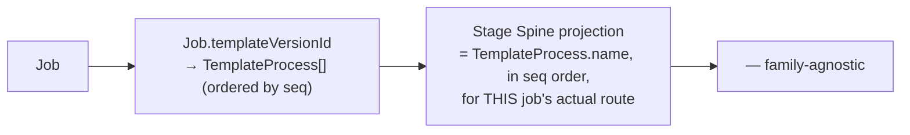

# 07 — DESPL MOS Workflow and Routing Model

## 1. What replaces the hardcoded Stage Spine

**`CURRENT`, verified — this is the single most visible DESPL-320-shaped coupling in the UI layer:** `src/lib/shared/stage-names.ts` hardcodes exactly 25 stage-name strings ("Shell Fabrication," "PWHT," "Hydro Test," etc.), and `workspace.read.ts` hardcodes `STAGE_COUNT = 25`. Both are consumed by the signature "Stage Spine" component (`<StageSpine />`) rendered on every job page, regardless of family. A second family degrades gracefully to a blank rollup rather than crashing (verified: no crash found), but its stage labeling and progress rollup do not work today.

**`TARGET`:** the UI must derive operational stages from the job's actual route rather than assuming a universal 25-stage pressure-vessel sequence.

Concretely: replace `STAGE_NAMES: Record<number, string>` (a static table keyed by an assumed 1–25 stage number) with a read that projects `TemplateProcess.name` (already a real, per-family-version field) in `seq` order for the job's own `templateVersionId`. This requires **no new schema** — `TemplateProcess` already carries everything needed; it is a query-and-render change, not a data-model change. This is why the forensic audit and this blueprint both classify it as a narrow, well-scoped fix rather than a structural rebuild.

**`GAP` carried forward:** `workOrderStages[]` (a `TemplateProcess` crosswalk field, per the ADR's own table) already exists as the intended mechanism for "a family need not use the 25-stage reporting view at all" — the Stage Spine component simply doesn't consume it yet. This is a REFACTOR of the read path, not new schema (see `17`).

## 2. Workflow engine — verified primitives

| Primitive | Model | Notes |
|---|---|---|
| Operation (definition) | `TemplateProcess` (schedule spine) / `RouteStep` (component route) | Both versioned via their parent template |
| Dependency | `TemplateEdge`/`JobProcessEdge` | Process-to-process, typed (`FINISH_TO_START`, `START_TO_START_WITH_OVERLAP`) |
| State | `ProcessPlanStatus` (schedule grain, 5 discrete states) / `OperationStatus` (execution grain) | Two separate state machines at two grains — see `03` |
| Transition | `assertCanStart`/`assertCanComplete` (`gating.ts`) | Status-only, never date-based (verified: gating.ts "never looks at dates at all") |
| Condition | Predecessor status, hold-point clearance, drawing-release, kit-readiness | Composable gates, each a named `assertX` function |
| Actor | `Actor` (role + department scope) | Every mutation carries an actor, checked server-side |
| Timestamp | Server-clock only (invariant #1) | No client-supplied `actual_*` field accepted anywhere |
| Evidence | `ProcessEvidenceKind` enum + linked records (QC execution, dispatch record, etc.) | `assertEvidenceSatisfied` — real, used to gate `JobProcess` completion on e.g. dispatch proof |

**`CURRENT`, verified real:** sequential, parallel (via `START_TO_START_WITH_OVERLAP` edges — legitimate concurrent work, not a scheduling illusion), and conditional (hold points, drawing gates, kit-readiness) operation flow all exist and are exercised. Rework exists as a real state (QC's `REWORK_IN_PROGRESS`) with reinspection. Cancellation is **not evidenced** as a first-class workflow state at the `ProcessPlan`/`ComponentOperation` grain — `DECISION REQUIRED` (`20`): does the MOS need a formal "job cancelled mid-execution" path, or does this stay out of scope until a real cancellation scenario forces the question? No evidence today that DESPL has needed this.

## 3. Gating vs. scheduling — a distinction the codebase itself insists on, verified correct

**`CURRENT`, verified directly in `gating.ts`'s own header comment and code:** CPM lags relax the *schedule* (a negative-lag overlap edge lets a process start before its predecessor finishes, because that's real fitted concurrent fabrication) — they never relax *gating* (a process can never be marked COMPLETE ahead of any predecessor, regardless of lag sign). `gating.ts` never inspects dates at all, only status. This is invariant #11 (CLAUDE.md), verified as genuinely implemented, not just documented.

**`TARGET`:** preserve this separation exactly. Any future workflow engine work (e.g., a visual route builder) must keep gating logic (status-based, transaction-local, server-enforced) and scheduling logic (date computation, CPM) as two composable, independently testable modules — collapsing them would reintroduce the class of bug invariant #11 exists to prevent.

## 4. Holds, rework, exceptions

- **Hold points**: H-coded QCP checkpoints are a hard block (`assertNoOpenHoldPoint`) — verified, no admin bypass.
- **Witness waivers**: W-coded checkpoints are *documented* as requiring Production Head approval (`QcpExecution.waiverApprovedBy` schema column exists) but **`GAP`**: no service function ever writes that column, and no code path checks or blocks on it today. This is a schema-only gate, not a working one — see `11`.
- **Rework**: `Ncr.status` (`OPEN → REWORK_IN_PROGRESS/DISPOSITIONED → CLOSED`) is a real, tested state machine.
- **Delay filing**: `fileDelayReason` writes a `DelayReason` row and clears the "you may not keep working until you explain the delay" gate (invariant #7, verified real) — but has **zero imports from the scheduling engine**, meaning it does not itself trigger a reschedule. See `09` for the delay-propagation gap.

## 5. What a configuration-driven workflow requires, going forward

For a new family's workflow to be genuinely "configuration, not code":

1. A `RouteTemplate` authoring UI (currently missing — `06`).
2. A `ProcessTemplate`/`TemplateProcess`/`TemplateEdge` authoring UI beyond clone-from-existing-family (partially present — `/admin/templates` supports cloning, not authoring a DAG from scratch for a brand-new family).
3. The Stage Spine projection fix (§1) so the UI doesn't silently assume 25 pressure-vessel-named stages.

None of these require new schema. All three are UI/read-path work on top of an already-generic write model — this is the pattern this blueprint identifies repeatedly (`06`, `08`, `14`): **the mechanism is ahead of the tooling to configure it.**

---
*Sources: `src/lib/shared/stage-names.ts`, `src/lib/services/workspace.read.ts`, `src/lib/schedule/gating.ts`, `src/lib/services/_shared.ts` (`assertEvidenceSatisfied`), `docs/ADR-product-family-agnostic-platform-v1.md`, `docs/DESPL_MOS_FORENSIC_AUDIT.md` §17, §19, §36.*
