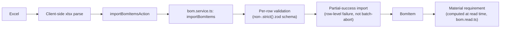
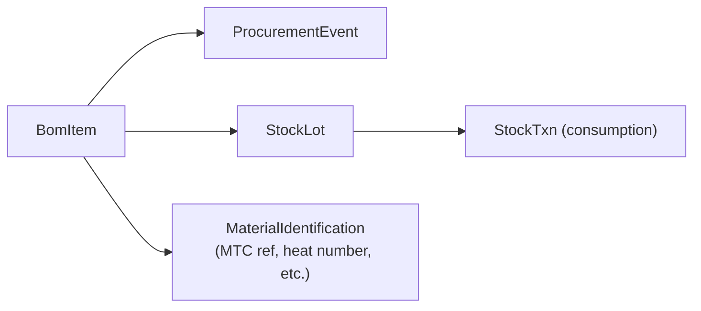

# 08 — DESPL MOS BOM / Material / Procurement Model

## 1. BOM ingestion pipeline — verified against the actual code path

**`CURRENT`, verified real (not just a seed script):** client-side `xlsx` parse → `importBomItemsAction` Server Action → `bom.service.ts`'s `importBomItems`, traced into a generic `/jobs/[id]` route reachable by any admin/production-head user for any job.

| Capability | Status | Evidence |
|---|---|---|
| Header matching | **Robust** | Alias-based, normalization-tolerant ("Item No"/"item_no"/"ItemNo"/"Sr No" all resolve); column order irrelevant |
| Malformed row handling | **Robust** | Fails individually with a row number; rest of batch still imports (tested) |
| Unrecognized extra columns | **Tolerant** | Silently dropped (non-`.strict()` schema, tested) |
| Duplicate item numbers | **`GAP`** | Not detected — no dedup check, no DB unique constraint |
| Multi-sheet workbooks | **`GAP`** | Only `SheetNames[0]` is ever read (hardcoded) |
| Units | **`GAP`** | Free text, no canonicalization — `"kg"`/`"Kg"`/`"KGS"` persist as distinct strings |
| Component-type linkage | **`GAP`** | Bulk-imported rows are not linked to `ComponentTypeRef` — the bulk schema has no `componentTypeId` field at all |

**`TARGET`:** canonical BOM model additions — a per-tenant UoM canonicalization table (mirroring the existing reference-table pattern, not a new architectural concept), a duplicate-item-number check at import time (warn, don't block, consistent with the partial-success philosophy already in place), and multi-sheet selection in the upload UI. All three are additive to the existing pipeline, not redesigns.

## 2. Canonical BOM model — what it contains today

**`CURRENT`, verified:** `Job → Equipment → BomRevision → BomItem`. Quantity is split between a verbatim source string (`BomItem.sourceQty`, e.g. `"40 NOS."`) and a parsed decimal (`qtyPer`) — a reasonable, if unusual, two-field compromise for messy source data, preserving the original for audit while giving downstream code a computable number. `BomItem.parentBomItemId` supports a self-referencing tree (multi-level BOM) with **no depth limit** — a real scalability caveat (`17`), not a modeling flaw.

**Revisions**: `BomRevision.status` (`BomRevisionStatus` enum) is real and increasing-revision-enforced (`BOM_REVISION_NOT_INCREASING` error code exists and is live), following the same "corrections create new versions, originals stay visible" pattern (invariant #6) used elsewhere.

**Errors**: a malformed row fails with a row number, never silently drops data or aborts the whole batch — a deliberate design choice, verified.

## 3. Material / stock chain

**`CURRENT`, verified:** the chain `Job → Equipment → BomItem → ProcurementEvent/StockLot/MaterialIdentification → StockTxn` is real and well-indexed. Available/required/shortage quantities are computed **at read time** (`bom.read.ts`), never stored — and the code is explicit that a BOM item with zero stock activity shows `shortage: null` rather than a fabricated zero, a good instinct that avoids false confidence in an unmonitored line item.

**`GAP`, real:** no required-by date exists at the material level — only job-level `committedDeliveryDate`/`targetDispatchDate`. No allocation/reservation model exists — stock is inherently partitioned by `BomItem` → `Equipment` → `Job`, which sidesteps rather than solves cross-job material contention (there is currently nothing for two jobs to compete over because nothing lets them share a stock pool in the first place — this becomes a real gap the moment DESPL wants to buy material in bulk across jobs).

## 4. Material-blocks-production visibility — the actual gate, and where the docs disagree with the code

**`CURRENT`, verified directly:** `assertKitReady` (`_shared.ts:684`) throws `MATERIAL_NOT_AVAILABLE` and is wired into `startComponentOperation`. **But** it silently no-ops for any BOM item that has never had a single stock transaction logged (no data to check against, so nothing is asserted). **`CLAUDE.md`'s own invariant #2 states material-dependency gating "is not implemented"** — this is documentation drift, not a fabricated gate: the code that implements it (at the component-operation grain, not the stage grain CLAUDE.md's text describes) was committed a day before that text was last read. **This blueprint recommends fixing the CLAUDE.md text as part of Phase B of the roadmap (`18`)** — a one-line correction, not an engineering task.

## 5. Procurement chain — verified as real but thin

**`CURRENT`, verified:** `ProcurementEventType` is a four-value enum (`INDENT_RAISED | INDENT_APPROVED | PO_PLACED | RECEIPT`) and is, by the code's own comment, the *entire* status model — "there is no separate status enum to keep in sync." `procurement.service.ts` is 55 lines, a single append-only event writer (verified: `recordProcurementEvent`, no update/delete counterpart anywhere). Visibility comes from `bom.read.ts`'s shortage calculations, not from procurement's own reporting.

| Stage (brief's proposed chain) | Exists today? |
|---|---|
| Material Requirement | Yes — computed at read time |
| Procurement Requirement / Indent | Yes — `INDENT_RAISED`/`INDENT_APPROVED` events |
| Approval | Yes — `INDENT_APPROVED` is a distinct event, but no approval-role gate beyond ADMIN/PRODUCTION_HEAD write access |
| Purchase Order | Yes — `PO_PLACED` event, **no dedicated `PurchaseOrder` model, no vendor field anywhere in the schema** |
| Expected Delivery | **`GAP`** — no field exists; "pending" can only be inferred from the absence of a `RECEIPT` event; "delayed" cannot be computed at all |
| Receipt | Yes — `RECEIPT` event |
| Inspection | Partial — `MaterialIdentification`/`ItemTest`/`PmiResult` exist as real inspection records, not formally chained to receipt |
| Available / Allocated / Consumed | Available: yes (`StockLot`). Allocated: **no model**. Consumed: yes (`StockTxn`) |

**`TARGET`:** the highest-leverage procurement addition is a vendor field and an expected-delivery-date field on the procurement event or a new lightweight `PurchaseOrder` model — this unblocks "delayed" as a computable state, which today literally cannot exist for lack of a due date to compare against. This is additive schema work, not a redesign of the event-ledger pattern (which this blueprint preserves — append-only, no separate status enum to drift).

## 6. Which stages are generic MOS vs. procurement-specific vs. production-specific

| Layer | Belongs to |
|---|---|
| BOM structure, revisions, item tree | MOS Core (family-agnostic, verified) |
| Material requirement computation | Operational Framework (shared shortage-calculation logic, reusable across families) |
| Procurement event ledger, vendor/PO (target) | Operational Framework — procurement is a department capability, not core identity/org data |
| Stock lots, consumption | Production execution boundary — shared mechanism, department-owned data (STORES) |

---
*Sources: `src/lib/services/bom.service.ts`, `src/lib/services/bom.read.ts`, `src/lib/services/procurement.service.ts`, `src/lib/services/_shared.ts` (`assertKitReady`), `prisma/schema.prisma` (`BomItem`, `ProcurementEvent`, `StockLot`, `StockTxn`, `MaterialIdentification`), `CLAUDE.md` invariant #2, `docs/DESPL_MOS_FORENSIC_AUDIT.md` §11, §12, §20.*
