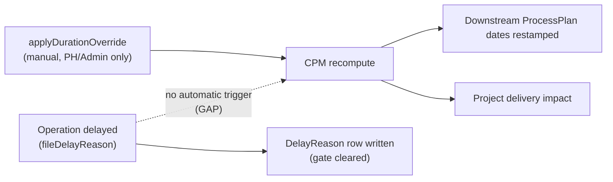

# 09 — DESPL MOS Scheduling Model

## 1. The verified two-layer model (preserve, unchanged)

**`CURRENT`, verified directly in `cpm.ts`'s own header comment and confirmed by the code:** invariant #10 ("never sum durations to build a schedule") is genuinely implemented, not just documented. Layer 1 is an authoritative "envelope" read directly from the printed lead-time table (`seed/lead-time-model.json`); Layer 2 is a real CPM DAG (`src/lib/schedule/cpm.ts`) whose lags are fitted so that using `durationMaxDays` throughout, the forward-pass formula reproduces the envelope's `finishByMaxDays` **exactly at every one of the 36 processes**, including the terminal P36 = 119 days — verified as a real, checked property, not an aspirational claim.

```
earlyStart[process] = max over predecessor edges of (earlyFinish[predecessor] + edge.lagDays)
```

- **Algorithm**: Kahn's algorithm for topological sort (throws on a cycle — the DAG must be acyclic by construction), then a standard forward/backward CPM pass computing early/late start/finish, total float, and criticality.
- **Edge types**: `FINISH_TO_START` (predecessor must be `COMPLETE`) and `START_TO_START_WITH_OVERLAP` (predecessor need only have started — legitimate concurrent work, keyed off `type`, not off `lagDays` sign, verified as the deliberately correct design in `gating.ts`'s own comment).
- **Calendar-aware**: working-day arithmetic, 6-day week default (`WorkCalendar`/`Holiday` models).
- **Not capacity-aware**: **`GAP`**, verified — no labor/resource-capacity constraint exists anywhere in the scheduling code. A department could be assigned more concurrent work than it has people for, and the schedule would not know.

## 2. `TARGET`: what scheduling algorithm conceptually remains

This blueprint's recommendation, per the brief's own instruction not to implement, only decide the shape: **keep the CPM-with-fitted-envelope model as the core**, and add a **capacity-awareness layer on top**, not instead of it. Concretely: continue computing dependency-driven early/late dates exactly as today, then run a secondary pass that flags (not silently resolves) department-level overallocation against a configured headcount/shift capacity per department per day. This is additive — CPM stays the source of truth for "is this process gated," capacity becomes an advisory signal for "is this date realistic," which matches how the codebase already separates gating from scheduling (`07` §3) and should follow the same separation-of-concerns discipline.

**`DECISION REQUIRED` (`20`):** should capacity constraints ever become a *hard* gate (a process cannot be scheduled to start if it would overallocate a department), or stay advisory (flagged, human decides)? No evidence in the current system suggests DESPL wants automatic reallocation — recommendation is **advisory only**, consistent with the codebase's existing preference for "refuse and explain" over "silently reallocate" (invariant #12).

## 3. Delay propagation — the real gap, verified precisely

**`CURRENT`, verified:** filing a delay reason (`fileDelayReason`) only writes a `DelayReason` row and clears the "you may not keep working until you explain the delay" gate — it has **zero imports from the scheduling engine**. Cascading reschedule genuinely exists and genuinely recomputes CPM and restamps every downstream process's dates — but only through a **separate, manual, Production-Head/Admin-only action** (`applyDurationOverride`). There is no automatic trigger connecting the two.

Direct answer to the brief's own worked example ("welding delayed 3 days — does NDT/QC/Painting/Dispatch move automatically?"): **No, not automatically.** A supervisor reporting a 3-day welding delay does not, by itself, move downstream dates. A human planner has to notice the slip and manually apply an override for the DAG to re-date downstream work.



**`TARGET`:** an auto-*suggest* trigger — when a delay reason is filed, compute what the cascading reschedule *would* produce and surface it to the Production Head as a one-click "apply this reschedule" action, rather than requiring them to notice the slip and invoke the override tool separately. This preserves the human-confirmation-before-committing-to-new-dates behavior (which is arguably correct for a company that wants a person accountable for schedule changes) while removing the "someone has to notice" failure mode. **`DECISION REQUIRED` (`20`):** should this ever become fully automatic (no human confirmation) for small delays below some threshold? Recommendation: no — the audit trail and accountability model (`13`) depend on a named human approving schedule changes; automation should reduce *friction*, not remove the *approval*.

## 4. What must be immutable/auditable in scheduling (verified real)

- `ScheduleRun.isCurrent` — a reschedule never deletes the old run's `ProcessPlan` rows; superseded baselines stay intact (verified, and independently confirmed by `admin.read.ts`'s own comment about why it must filter on `scheduleRun.isCurrent` explicitly).
- Every `applyDurationOverride` writes `AuditLog` before/after state (invariant #5, verified 78 call sites include schedule overrides).
- `OVERRIDE_REASON_REQUIRED` is a live, enforced error code — an override cannot be applied without a recorded reason.

## 5. Risk signal (feeds `14`)

Scheduling data (float, criticality, overdue flag) already feeds `myday.read.ts`'s per-row output — `overdue flag`, `critical-path flag`, `float days` are real, computed fields, not placeholders. This is the raw material `14`'s KPI/risk framework should consume rather than recompute independently (today it is recomputed independently in at least four different `.read.ts` files — see `14`).

---
*Sources: `src/lib/schedule/{cpm,gating,calendar,exclude}.ts`, `seed/lead-time-model.json`, `src/lib/services/{admin.read,myday.read,override}.ts`, `CLAUDE.md` invariants #10, #11, `docs/DESPL_MOS_FORENSIC_AUDIT.md` §18, §19.*
