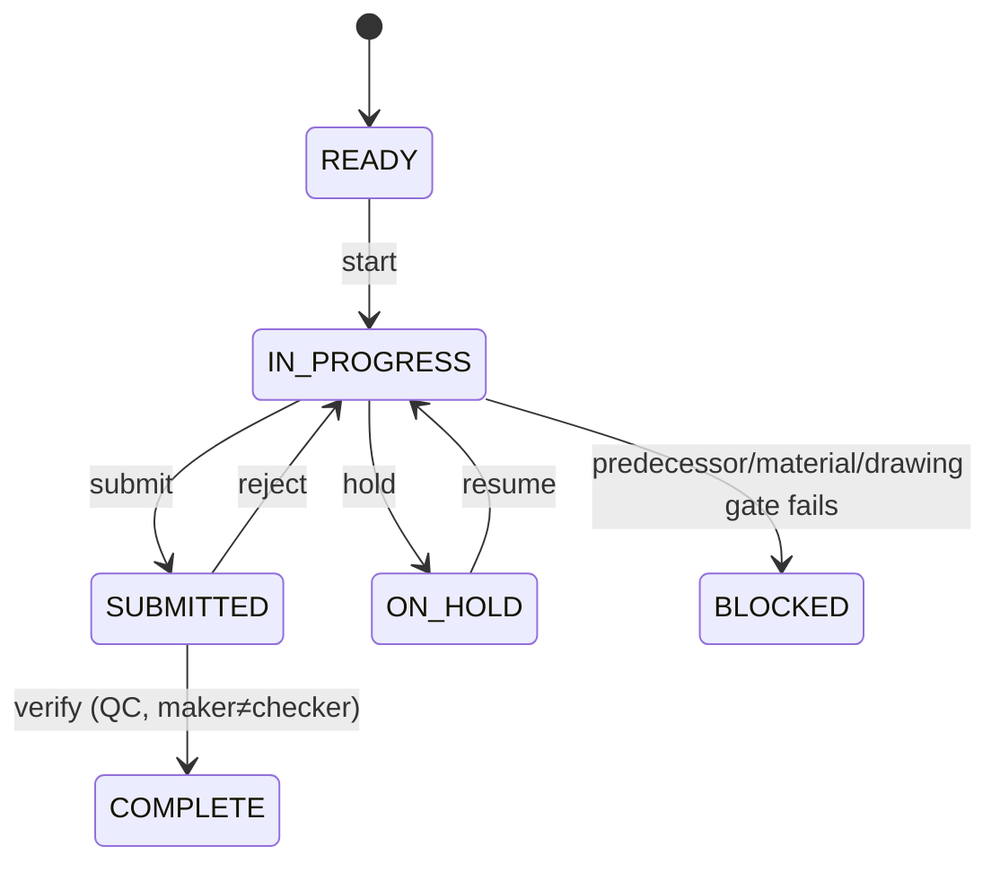

# 10 — DESPL MOS Production Execution Model

This is the system's strongest verified area — Maturity 5/5 per the forensic audit's own scoring, independently corroborated here.

## 1. The verified execution hierarchy

`Job → Equipment → Unit (serial) → Component/AssemblyStep → ComponentOperation`, feeding upward into `JobProcess`/`ProcessPlan` for the department/schedule view (`03`, `05`).

## 2. The "what needs to happen today" view — verified genuinely producible, not aspirational

**`CURRENT`, verified:** `myday.read.ts` returns, per row: process name, serial, stage label/number, department, assignee, planned window, a five-state status (`BLOCKED`/`READY`/`IN_PROGRESS`/`SUBMITTED`/`ON_HOLD`/`DONE`), overdue flag, critical-path flag, float days, blocking-predecessor IDs, and a **human-readable reason string generated from real CPM/gating data**, not a template placeholder — e.g. *"Waiting on: X, Y."* / *"Ready to start — on the critical path."* / *"Overdue — file a delay reason to continue."*

There is no numeric "progress %" at the plan grain (status is five discrete states, deliberately not a percentage), but `ComponentOperation.qtyGood/qtyRejected` gives real partial-quantity progress at the granular execution grain — the two grains complement rather than duplicate each other.

## 3. The execution state machine — verified server-enforced, not client-trusted

**`CURRENT`, verified:** `start → submit → verify/reject → hold/resume` is a genuine, server-enforced state machine, **row-locked** (`SELECT … FOR UPDATE`) inside the same transaction as the gate check and the audit write — never a client-settable status field. Assignment, delay-reason filing, rejection-with-NCR-linkage, and hold/resume are all real, tested code paths.

**`GAP` (two, explicitly flagged in code, both narrow):**
1. Resuming from `ON_HOLD` always lands on `IN_PROGRESS` — a prior `SUBMITTED` state cannot be restored (a unit held mid-QC-review, once resumed, loses its "was already submitted" position).
2. Delay-reason review/dispute-acknowledgement is deferred — a filed delay reason has no formal "management reviewed and accepted this explanation" step.

## 4. Assignment and responsibility

`ProcessPlan.assigneeUserId`, set via a real claim/assign/release service — a plan can legitimately sit unassigned in a department's pool. "Who is responsible for this work right now" resolves to **a department plus an optional named assignee**, never guaranteed to be a specific person (`13`).

## 5. Production KPIs already computable from real data (not placeholders)

- `qtyGood`/`qtyRejected` → first-pass yield.
- Cycle-time-vs-standard, working-day-aware.
- Overdue aging by department.
- Welder repair rate % with an alert threshold, welder joints-vs-team-average (`Welder`/`WeldJoint`/`WeldLog` — real, department-specific richness beyond the generic `ComponentOperation` model).

## 6. `TARGET`: what production execution needs that isn't there yet

| Capability | Status |
|---|---|
| Restore prior state on resume-from-hold | `GAP` — narrow fix, add a "state before hold" field |
| Delay-reason review/acknowledgement | `GAP` — a formal management-review step on `DelayReason` |
| Geo-tagged photo evidence | Deliberately deferred (documented Phase-2 scope, a component file even comments the camera/geotag section was "deliberately omitted") — not a surprise gap |
| Offline writes | Deliberately deferred, same as above |
| Equipment-level dashboard | `GAP` — no dedicated equipment-grain view exists; equipment only appears as a filter dimension inside job-scoped views (`14`) |

None of these require a redesign of the state machine itself — the machine is sound; the gaps are additive fields/views on top of it.

## 7. Shop-floor experience — current reality, verified more built than planning docs suggest

**`CURRENT`, verified:** a responsive shell (three variants — sidebar / icon-rail / bottom-nav), CSS-only breakpoint switching, a `pointer:coarse` density layer, and a reusable `<ResponsiveTable>` primitive are shipped and used across `/workspace` and `/my-day`. A Playwright viewport-matrix spec exists with eleven explicit `test.fixme()` markers, each naming exactly what's still pending — an honest, not hidden, accounting of remaining work.

**`GAP` (carried from a prior specialized audit, not independently re-verified as fixed here — treat as open until re-checked):** most routes unreachable below 1024px width via the rail nav; sign-out is desktop-only; a QCP grid is missing horizontal-scroll wrapping; a hard Safari-pre-16.4 rendering floor from unguarded `oklch()`/`color-mix()` CSS.

**`TARGET` shop-floor experience** (from the brief's own framing, verified as the right question given what `myday.read.ts` already answers): a worker/supervisor should be able to answer *what do I have to do / what's running / what's blocked / what needs QC / what did I complete / what's next* — and the data pipeline for all six already exists in `myday.read.ts`. The remaining work is closing the four cross-device gaps above, not building new read logic.

---
*Sources: `src/lib/services/myday.read.ts`, `src/lib/services/component.service.ts`, `src/lib/services/welding.service.ts`, `e2e/*` viewport specs, `docs/DESPL_MOS_FORENSIC_AUDIT.md` §13, §31, §39 (item 11).*
