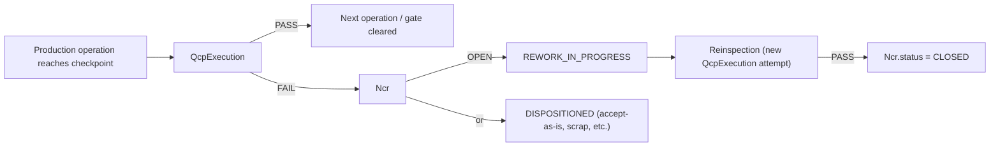

# 11 — DESPL MOS QC / NCR / Rework Model

QC is the most mature department in the codebase — verified independently, not taken on the audit's word alone (`QcpTemplate`/`QcpItem`/`QcpExecution`/`Ncr` all carry real service functions, not UI-only status fields).

## 1. The verified model

- **Inspection plans**: `QcpTemplate`/`QcpItem`, multi-party P/W/H hold-point codes.
- **Execution records**: `QcpExecution`, attempt-numbered, server-stamped inspector/timestamp fields.
- **NCR state machine**: `OPEN → REWORK_IN_PROGRESS/DISPOSITIONED → CLOSED` — real, tested.

## 2. Maker-checker and hold points — verified exactly as documented

**`CURRENT`, verified directly:** maker-checker for QC verification is enforced exactly as CLAUDE.md's invariant #3 states, **with no admin bypass** — verified directly in `assertMakerChecker`. Hold points (H-coded) are a genuine hard block (`assertNoOpenHoldPoint`, called from `verifyProcess`) — no exceptions found.

## 3. The one real gap versus the documented invariant

**`GAP`, verified precisely:** witness (W-coded) waivers are described in the seed data's own legend as needing "Production Head approval, audited" — but `QcpExecution.waiverApprovedBy` is a schema column that is **never written anywhere in the service layer**. Today a W-checkpoint has no `blocksCompletion` gate at all and no code path stamps or checks a waiver approval; the QC service's own comment says this is deliberately deferred to Phase 2. This is a **documented gap, not a silent one** — but it means invariant #4 as literally written in CLAUDE.md is only half-true today (H-points: fully enforced; W-points: schema-ready, not wired).

**`TARGET`:** wire `waiverApprovedBy` into a real approval action (Production Head role, audited, same pattern as `applyDurationOverride`'s `OVERRIDE_REASON_REQUIRED`) and add the missing `blocksCompletion` check for W-points. This is a narrow, well-scoped fix — the schema and the documented business rule already agree; only the service-layer wiring is missing.

## 4. DFT / painting acceptance — a related, smaller gap

**`GAP`, verified:** DFT (dry film thickness) acceptance is self-attested with no spec'd micron range to validate against. `PaintRecord`/`DftReading` are real, generic, per-component-operation models, but nothing in the service layer checks a reading against an acceptable range before accepting it as PASS.

## 5. Relationships — operation, inspection, QCP, NCR, rework, evidence, approval

| Relationship | Model | Verified behavior |
|---|---|---|
| Operation → Inspection | `ComponentOperation`/`AssemblyStep` → `QcpExecution` (via matched `QcpItemProcess`) | Real, checkpoint-triggered |
| Inspection → QCP | `QcpExecution` → `QcpItem` → `QcpTemplate` | Real, per-family template, cloned per job |
| Inspection → NCR | Fail → `Ncr` created, linked | Real |
| NCR → Rework | `Ncr.status = REWORK_IN_PROGRESS` | Real, reinspection cycles through a new `QcpExecution` attempt |
| Rework → Evidence | Attempt-numbered `QcpExecution` rows | Real — full history preserved, not overwritten (consistent with invariant #6, no destructive edits) |
| Approval → Waiver | `QcpExecution.waiverApprovedBy` | **Schema-only** — see §3 |

## 6. `TARGET`: QC as the reference implementation for other departments

Because QC is the most mature department, this blueprint recommends its pattern — attempt-numbered execution records, a real disposition state machine, hold points as hard server-side blocks — as the template other departments (particularly Documentation and Procurement, both thin today per `04`/`08`) should be brought up to, rather than inventing a new pattern for each. This is a consistency recommendation, not new architecture.

---
*Sources: `prisma/schema.prisma` (`QcpTemplate`, `QcpItem`, `QcpExecution`, `Ncr`), `src/lib/services/qcp.service.ts`/`ncr.service.ts` (assertMakerChecker, assertNoOpenHoldPoint), `seed/lead-time-model.json` (P/W/H legend), `CLAUDE.md` invariants #3, #4, `docs/DESPL_MOS_FORENSIC_AUDIT.md` §14, §15.*
