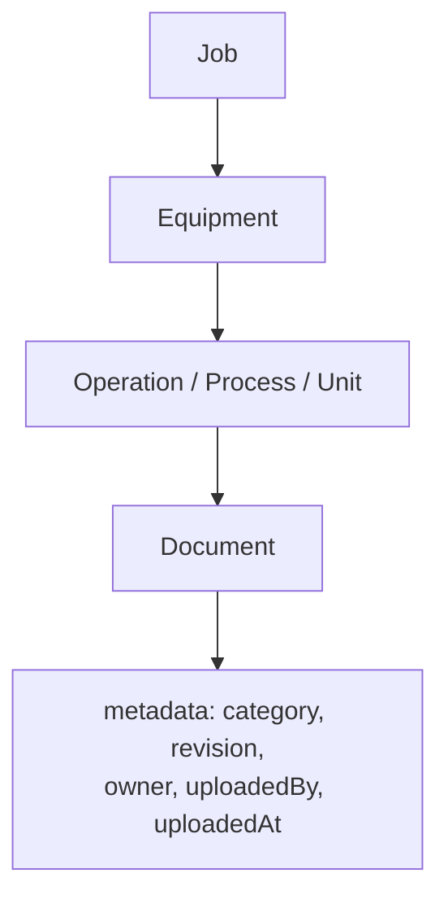

# 12 — DESPL MOS Document Model

## 1. Current state: no file storage exists

**`CURRENT`, verified by exhaustive search:** no file/attachment storage exists anywhere in the application — confirmed by an exhaustive grep for multipart handling, `S3Client`, `uploadFile`, or any blob-storage client, finding none. This matches CLAUDE.md's own stated Phase-2 deferral. Every "document" reference in the schema (`MaterialIdentification.mtcRef`, `poRef`, `wpsRef`, `jointRef`, drawing revisions) is a **free-text string field** with no validation that it points to a real file — a certificate number can be typed and never checked against anything.

For a MOS meant to carry QC certificates, drawings, and photographic evidence, this is a real, currently unaddressed capability gap — not a partial implementation to extend, a genuine `MISSING`.

## 2. Target document model

**Categories** (derived from what the schema already references as free text, not invented): BOM, Drawing, Revision, MTC, Inspection report, QC evidence, NCR, Certificate, Photo, Dispatch document.

**`TARGET` design, consistent with existing architecture:**

- An S3-compatible object store (matching the sibling prototype repo's own existing pattern, per the forensic audit — this is not a new integration pattern for the team).
- A `Document` model: `id`, `tenantId`, category, storage key, filename, mime type, size, `uploadedBy`, `uploadedAt`, and a polymorphic or explicit link to the owning entity (`jobId`/`equipmentId`/`componentOperationId`/`qcpExecutionId`/etc.).
- Revisioning follows the codebase's existing pattern exactly (`DrawingRevision`'s strictly-increasing-revision, prior-flips-to-SUPERSEDED model) rather than inventing a new versioning scheme.
- Permissions inherit from the owning entity's existing RLS/tenant-scoping — no new authorization concept needed, since every document is reached through an already-scoped parent (same convention `_shared.ts` already uses for tables without their own `tenantId`).
- Audit trail: every upload/download is an `AuditLog`/`DomainEvent` entry, same as every other mutation (invariant #5).

## 3. What currently substitutes for documents, and where that breaks down

| Field | Model | What it actually is today |
|---|---|---|
| `MaterialIdentification.mtcRef` | Free text | A typed reference, never checked against a real file |
| `poRef` | Free text | Same |
| `wpsRef`, `jointRef` | Free text | Same |
| `AssemblyDrawing`/`DrawingRevision` | Real versioned records | Metadata about a drawing exists and is well-modeled; **the drawing file itself is not stored anywhere** |

This is the clearest evidence that the *metadata* discipline (versioning, revision-tracking, audit) is already correct and should be preserved — only the actual file bytes are missing a home.

## 4. Priority and sequencing

This blueprint places document/file storage at **P1** (`17`) — not because it's architecturally hard (it isn't; it's a clean addition on top of an already-correct metadata model) but because a QC-heavy manufacturing MOS with no way to attach a certificate, drawing, or photo to a record is a real operational gap management will hit immediately upon relying on the system for compliance records.

---
*Sources: exhaustive grep for file/blob-storage clients (`docs/DESPL_MOS_FORENSIC_AUDIT.md` §28), `prisma/schema.prisma` (`MaterialIdentification`, `AssemblyDrawing`, `DrawingRevision`), `CLAUDE.md` deferred-to-Phase-2 list.*
