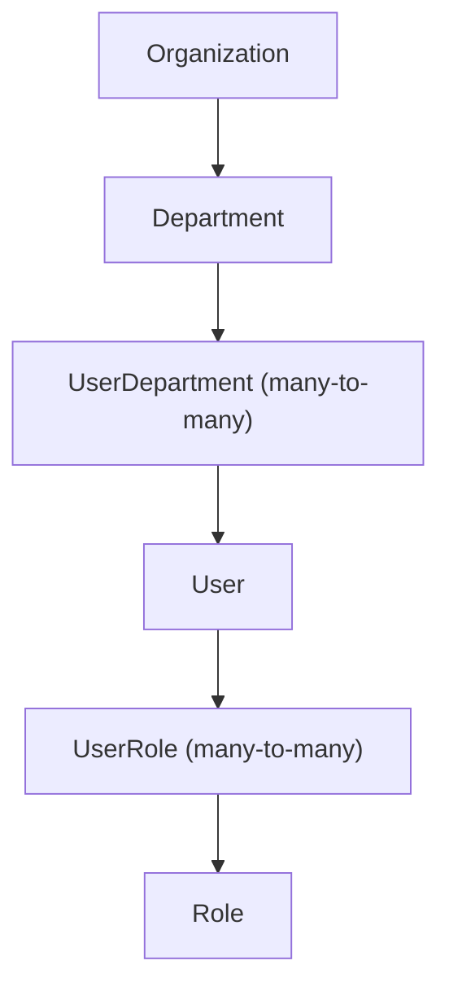
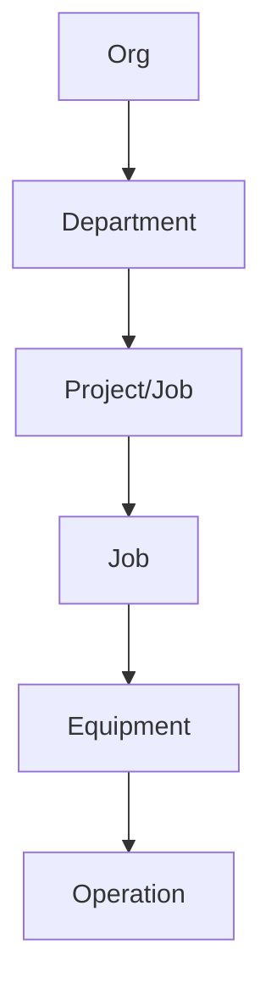

# 13 — DESPL MOS People / RBAC Model

## 1. Verified role set — corrected against a red herring in the repo tree

**`CURRENT`, verified:** six real roles exist — `ADMIN, MANAGEMENT, PRODUCTION_HEAD, SUPERVISOR, QC, CLIENT_VIEWER` (`src/lib/authz/index.ts`'s `ROLES` const). This is materially different from a generic "Director/GM/Department Head/Employee" role set that appears elsewhere on the user's machine — that set belongs to an unrelated sibling prototype (`DHRUV OS PROTOTYPE`, a separate, much smaller FastAPI/Next.js scaffold in the same parent folder), **not** to this repository. This blueprint uses only the six roles verified directly in `authz/index.ts`.

## 2. Responsibility model

**`CURRENT`, verified:** `User ↔ Department` is a real many-to-many join (`UserDepartment`) used to scope supervisors. **There is no separate `Team` model and no manager/supervisor hierarchy FK** — a department's "supervisor" is derived at read time by filtering for users holding the `SUPERVISOR` role in that department, not a first-class relationship.

"Who is responsible for this work right now" resolves to **a department plus an optional named assignee** (`ProcessPlan.assigneeUserId`) — a plan can legitimately sit unassigned in a department's pool. The honest model: work is **always** attributable to a department, **not always** to a person.

## 3. Owner / assignee / executor / approver / supervisor / department head — mapped to real fields

| Concept | Real mechanism |
|---|---|
| Owner (department) | `ProcessPlan.jobProcessId → JobProcess.departmentId` |
| Assignee | `ProcessPlan.assigneeUserId` (nullable — unassigned is valid) |
| Executor | Whoever performs `start`/`submit` on a `ComponentOperation`/`AssemblyStep` — role-gated to department scope, not necessarily the named assignee |
| Approver (QC) | Maker-checker: QC role, and `actor != submitted_by` — enforced, no exceptions |
| Approver (schedule override) | `PRODUCTION_HEAD`/`ADMIN` only |
| Supervisor | Derived at read time: a user holding `SUPERVISOR` role within a department they're linked to via `UserDepartment` — not a stored relationship |
| Department head | Not a distinct role — a `SUPERVISOR` scoped to that department functions as its head; no separate hierarchy level exists |
| Accountable for delay | Whoever files the `DelayReason` — server-stamped, never anonymous |

**`DECISION REQUIRED` (`20`):** should a formal `Team` model and manager hierarchy be introduced, or does "department + role + optional assignee" remain sufficient? Current evidence: DESPL's actual org (per CLAUDE.md — MD, CEO, Production Head "SJ," department supervisors) is small and flat enough that the derived-at-read-time model has worked through the pilot job. Recommendation: **defer** — introduce a `Team` model only if/when DESPL's org grows past what department + role scoping can express (e.g., multiple supervisors needing sub-team splits within one department), not preemptively.

## 4. Session and security — verified sound

**`CURRENT`, verified:** session handling is sound — httpOnly, `sameSite=lax`, environment-conditional `secure` cookie carrying a signed JWT (`jose`, HS256), **not** localStorage (unlike the unrelated sibling prototype, which explicitly flags that as a known issue in its own CLAUDE.md — this repo does not share that problem). Roles/department scope are deliberately re-fetched from the database on every request (verified in `getActor`) rather than embedded in the token — a revoked role takes effect immediately, not at next token expiry. `session.sessionVersion !== user.sessionVersion` invalidates stale tokens on password change, verified directly.

Deny-by-default is real at two layers: a coarse JWT-presence check in `middleware.ts`, and a fine-grained `requireRole`/`requireDepartmentScope` call at the top of essentially every service function.

## 5. Gaps in RBAC enforcement architecture

**`GAP`, verified:** enforcement is **scattered by convention, not centrally intercepted** — there is no wrapper that automatically applies a role table per route/service function; a new mutation that forgets to call the right `require*` function would ship without an RBAC check and nothing structural would catch it. A dedicated `authz.test.ts` suite exercises the negative cases that do exist (including "an admin cannot verify their own submission — no exceptions," verified as a real test), but it is a hand-picked suite, not a static sweep.

**`GAP`, general security hardening:** rate limiting exists only for login and password-change, not general API-wide; no CSRF-token layer beyond the `sameSite` cookie flag and Next.js's framework-default Server Action origin check; **no CSP, X-Frame-Options, or HSTS configured anywhere** (`next.config.ts` is the default scaffold, no `headers()` block).

## 6. `TARGET` security architecture

- **Preserve**: the deny-by-default, re-fetch-on-every-request, no-embedded-claims session model — this is architecturally sound and should not change.
- **Add**: a structural enforcement layer (e.g., a typed decorator/wrapper around service functions that declares required role/department scope, checked at compile time or via a lint rule, not just convention) so a missing `require*` call fails a build rather than silently shipping. **P2**, additive, does not require touching the session/token design.
- **Add**: security headers (`headers()` block in `next.config.ts`) and general-purpose rate limiting. **P2**, low engineering cost, high risk-reduction.
- **Job-level isolation backstop**: see `15` (Data Architecture) and `17` — the highest-severity RBAC-adjacent gap is not RBAC itself but the lack of a database-level backstop for job-to-job isolation within a tenant.

---
*Sources: `src/lib/authz/index.ts` (`getActor`, `ROLES`), `src/lib/auth/session.ts`, `middleware.ts`, `next.config.ts`, `docs/DESPL_MOS_FORENSIC_AUDIT.md` §24, §25.*
