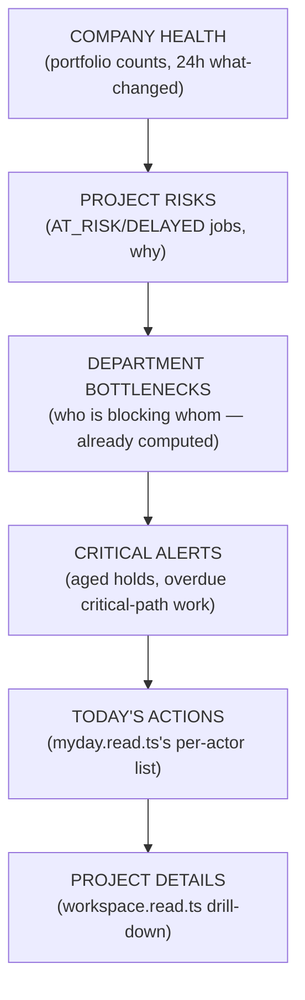
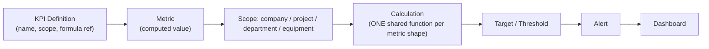
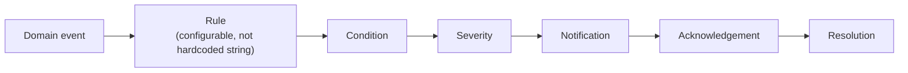

# 14 — DESPL MOS Management, KPI, and Alert Model

## 1. Management views — verified real at three of four grains

| Grain | Status | Evidence |
|---|---|---|
| Company | **Real** | `portfolio.read.ts` answers ON_TRACK/AT_RISK/DELAYED/ON_HOLD/COMPLETED/active counts across every job, plus a rolling 24-hour "what changed" feed from raw SQL joins across `domain_events`/`process_plans`/hold-point tables |
| Project/Job | **Real, rich** | `workspace.read.ts` computes percent complete, S-curve, first-pass yield, cycle-time-vs-standard, throughput vs. target, critical-path blocking, overdue aging by department |
| Department | **Real, rich** | `departments.read.ts` computes cross-job department cards (open/overdue counts, on-time %, rework counts) and drill-down detail (cycle time, reason breakdown) |
| Equipment | **`GAP` — no dedicated view** | Equipment only ever appears as a filter dimension inside job-scoped views; no equipment-grain dashboard exists |

**`GAP`, portfolio-level:** does not currently answer "due this week/due this month" or "which departments are overloaded" at the portfolio grain (that granularity exists only inside per-department/per-job views); no dedicated "blocked projects" bucket at the portfolio grain.

## 2. `TARGET` command center — information hierarchy

This hierarchy is derived from data that **already exists and is already computed** in four separate read services — the target command center is a composition/navigation change, not new computation. The one new capability needed is a portfolio-grain "due this week/month" and "blocked projects" rollup (additive queries against existing tables).

## 3. KPI architecture — real numbers, no shared framework (`GAP`, clearly bounded)

**`CURRENT`, verified:** a genuine, non-trivial set of KPIs is already computed from real data — department on-time %, job-level first-pass yield %, QC checkpoint yield %, welder repair rate % (with alert threshold), welder joints-vs-team-average, 30-day my-day on-time %, cycle-time delta (working-day-aware), weekly throughput and throughput-target.

**`GAP`:** the architecture is ad hoc, not a framework — there is no KPI registry, no shared calculation function. The *same shape* of calculation (on-time %, yield %) is independently re-implemented in at least four different `.read.ts` files, kept aligned only by cross-referencing comments, not by a shared function. Adding a new KPI today means writing a new query and calculation in whichever screen owns that view.

**`TARGET` KPI framework:**

This blueprint recommends consolidating the four duplicated "on-time %"/"yield %" calculations into one shared function per metric shape, parameterized by scope (company/project/department/equipment), consumed by all four `.read.ts` files rather than reimplemented in each. This is a refactor of existing, already-correct logic — not new business logic. **P3** (quality-of-life and correctness, not a blocker — the numbers are already right, they're just duplicated).

## 4. Alert engine — verified real, persistent, partially event-driven

**`CURRENT`, verified:** a genuine `Notification` model with `readAt` acknowledgement exists. Job-creation, plan-assignment, QC "nudge," and digest-published notifications fire **synchronously inside their triggering mutation's own transaction** — real event-driven behavior, not a batch job.

**`GAP`, verified precisely:**
- Overdue-stage and aged-hold-point alerts are computed **lazily** on every authenticated page load — a working mechanism, but one whose own code comment flags it as "fine at demo scale," a full-table scan on every page view.
- **Delay-reason filing and NCR opening currently generate no notification at all** — confirmed by grep: neither service calls the notification layer.
- Alert types are hardcoded string literals scattered per call site, not a configurable rule table.

**`TARGET` alert engine:**

Two concrete additions, both narrow: (1) wire delay-filing and NCR-opening to the existing notification layer — the layer already exists, these two triggers simply never call it; (2) move overdue/aged-hold detection from lazy page-load scan to a scheduled job (shares the same scheduler infrastructure need as the daily digest, `02` §5) — this is the load-bearing prerequisite named in `17` P2.

## 5. Operating rhythm dependency

Both the KPI consolidation and the alert-engine fix depend on the same missing piece: **a scheduler**. CLAUDE.md's own text already names the fallback ("Background jobs via Next.js route + cron, BullMQ/Redis only if load demands it") — load already demands it, evidenced by the two lazy/manual mechanisms documented here and in `02` §5. This blueprint treats "add a lightweight cron/queue" as a single P1/P2 infrastructure item that unblocks three separate gaps (daily digest delivery, alert reconciliation, and any future scheduled KPI snapshotting) rather than three separate pieces of work.

---
*Sources: `src/lib/services/{portfolio,workspace,departments,myday}.read.ts`, `src/lib/services/notifications.service.ts`, `prisma/schema.prisma` (`Notification`), `package.json` (no cron/queue dependency present), `docs/DESPL_MOS_FORENSIC_AUDIT.md` §21, §22, §23.*
