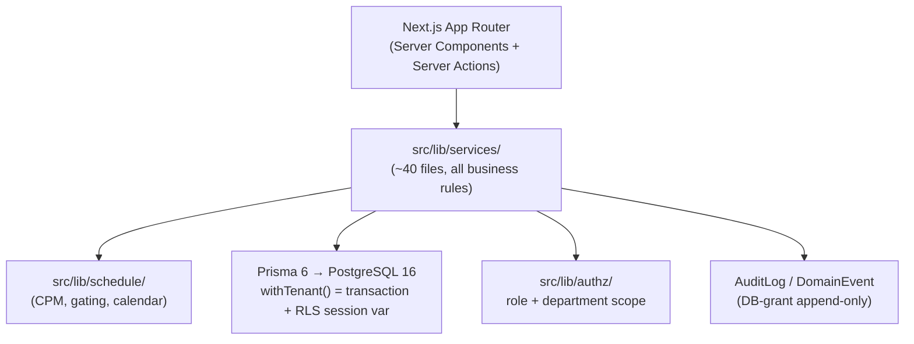
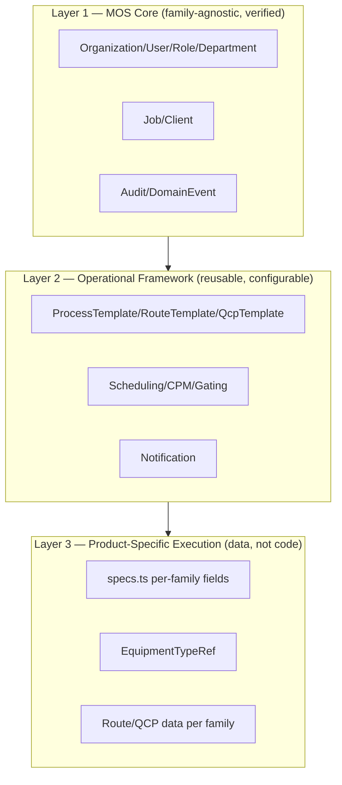
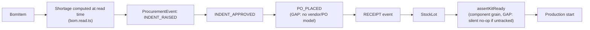
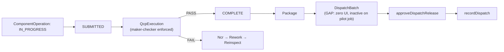
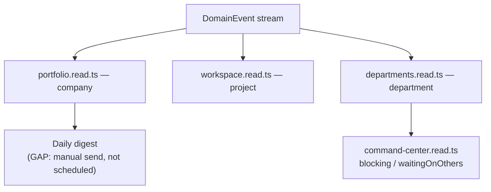

# 16 — DESPL MOS Target Architecture

## 1. System architecture — keep the modular monolith

**`CURRENT`, verified:** a single Next.js 15 (App Router) full-stack application — no separate backend service — with Server Actions doing every mutation, Prisma 6 against PostgreSQL 16. `src/lib/services/` (≈40 files) holds essentially all business logic; Server Actions are confirmed thin wrappers (**zero** Server Action files found making a direct Prisma call, across every file sampled). Zero cross-layer imports found between `lib/` and Next.js/React — the service layer is architecturally isolated from the framework already, which is precisely what would make a future service split *possible* without also making it *necessary*.

**`TARGET` decision: preserve the modular monolith.** A prior internal audit's recommendation not to split this into microservices is well-reasoned and this blueprint concurs for a verified reason: **four of the twelve non-negotiable invariants (gating, maker-checker, hold points, same-transaction audit) depend on single-Postgres-transaction atomicity** that a service split would have to painstakingly re-create across a network boundary. This is not a default conservative choice — it is the specific, correct consequence of how deeply transactional guarantees are load-bearing in this domain.



## 2. Conceptual service boundaries (within the monolith — not microservices)

Per the brief's own instruction: define boundaries without turning this into unnecessary microservices. Verified against the existing `src/lib/services/` file-per-domain convention (already the right shape):

| Conceptual boundary | Existing files (verified) | Target additions |
|---|---|---|
| Project Service | `job-intake.service.ts`, `jobs.read.ts` | — |
| Template/Workflow Service | `template.service.ts`, `template.read.ts` | Route/QCP authoring (`06`) |
| BOM Service | `bom.service.ts`, `bom.read.ts` | Dedup, multi-sheet, UoM canonicalization (`08`) |
| Procurement Service | `procurement.service.ts` | Vendor/PO model (`08`) |
| Scheduling Service | `src/lib/schedule/*` | Capacity-awareness layer (`09`) |
| Production Service | `component.service.ts`, `myday.read.ts` | Resume-from-hold state restore (`10`) |
| Quality Service | `qcp.service.ts`, `ncr.service.ts` | Waiver-approval wiring (`11`) |
| Document Service | **none today** | New (`12`) |
| Notification Service | `notifications.service.ts` | Delay/NCR triggers, scheduled reconciliation (`14`) |
| Analytics Service | Scattered across `.read.ts` files | KPI framework consolidation (`14`) |
| Admin Service | `admin.service.ts`, `admin.read.ts` | Family/route/QCP bootstrap UI (`06`) |

**This is not a proposal to reorganize files** — it is a naming of the boundaries that already exist as `src/lib/services/*.ts` file groupings, so future work has a shared vocabulary for "which service owns this."

## 3. Domain architecture — three layers, verified against the brief's own framework



**Boundary matrix** (the brief's required artifact):

| Capability | MOS Core | Operational Framework | Product-Specific | Project-Specific |
|---|---|---|---|---|
| Organization, User, Role, Department | ✅ | | | |
| Job, Client, Equipment, Unit | ✅ | | | |
| Audit/DomainEvent | ✅ | | | |
| ProcessTemplate/RouteTemplate/QcpTemplate mechanism | | ✅ | | |
| CPM/gating engine | | ✅ | | |
| Notification/Alert mechanism | | ✅ | | |
| Reference vocabularies (OperationRef, ComponentTypeRef, etc.) | | ✅ | | |
| Which stages a family's route contains | | | ✅ | |
| Per-family intake spec fields (`specs.ts`) | | | ✅ | |
| A specific job's pinned template version | | | | ✅ |
| A specific job's BOM, dates, assignees | | | | ✅ |

This matrix is verified against actual code placement, not assumed — every "MOS Core" row is family-branch-free in the service layer (checked directly); every "Product-Specific" row is expressed as data (a template/route/spec-map row), not a code branch.

## 4. Frontend information architecture — target navigation

**`CURRENT`, verified:** 19 real `page.tsx` routes exist under `src/app/(app)/`. Two (`/alerts`, `/board`) are literal placeholder stubs. `/workspace`'s default landing page still falls back to a hardcoded `jobNumber: "DESPL-320"` lookup when no job is specified (`17`).

**`TARGET` structure** (derived from the verified route list, not the brief's illustrative default):

```
MOS
├── Command Center       (dashboard — company/project/department composite, §14)
├── Projects              (jobs, jobs/new, jobs/[id])
├── Work                  (my-day — "what do I have to do today")
├── Departments            (departments, command/[dept], welding)
├── Quality                (qc cockpit)
├── Materials              (BOM panel, embedded in jobs/[id] today — could
                            become its own top-level surface as procurement matures)
├── Documents               (new — §12)
├── Alerts                  (currently a stub — needs the scheduled alert engine, §14)
├── Reports                 (reports — daily digest, exports)
└── Administration           (admin, admin/templates, admin/equipment-types —
                              target: + family/route/QCP bootstrap, §6)
```

This is evolutionary, not a rewrite of the route tree — every existing real route maps onto a node in this structure; the two stub routes (`/alerts`, `/board`) get real content rather than new URLs.

## 5. Cross-chain diagrams (brief-requested)

### BOM → Procurement → Production chain


### Production → QC → Dispatch chain


### Management information flow


## 6. AI boundary

| Capability | AI? | Deterministic? | Reason |
|---|---|---|---|
| BOM column/header mapping | Already alias-based, deterministic — AI not needed | ✅ | Verified working today without AI; adding AI here would trade a debuggable rule set for an opaque one with no evidenced benefit |
| Delay-risk prediction / portfolio risk scoring | Candidate | | No evidence today that rule-based risk scoring (schedule delay + material shortage + QC rejection signals, weighted) is insufficient — recommend **rule-based first** (`09` §2 already proposes this shape), AI only if a rule-based version proves inadequate in practice |
| Natural-language management queries ("what's blocking DESPL-320?") | Candidate | | Genuinely additive on top of the already-real `blocking`/`waitingOnOthers` computation — a good AI surface *because* the underlying data is already structured and truthful, not a substitute for structuring it |
| Document/certificate data extraction (once file storage exists, `12`) | Candidate | | Reasonable future use once documents exist to extract from |
| State transitions, gating, RBAC, audit, scheduling arithmetic | | ✅ | Must never be AI — these are the twelve non-negotiable invariants; correctness here is what makes the whole system's numbers trustworthy |

**Principle, consistent with the codebase's own demonstrated judgment (`06` §5):** AI is additive on top of a deterministic, auditable core — never a replacement for the gating/scheduling/audit invariants. The codebase's own restraint (rejecting an EAV table, walling `Job.specs` off from gating) is evidence the team would apply the same discipline to AI — this blueprint recommends the same standard.

---
*Sources: full route tree (`find src/app -name page.tsx`), `src/lib/services/*` file inventory, `docs/DESPL_MOS_FORENSIC_AUDIT.md` §5, §29, §30, §36, §40, §45.*
