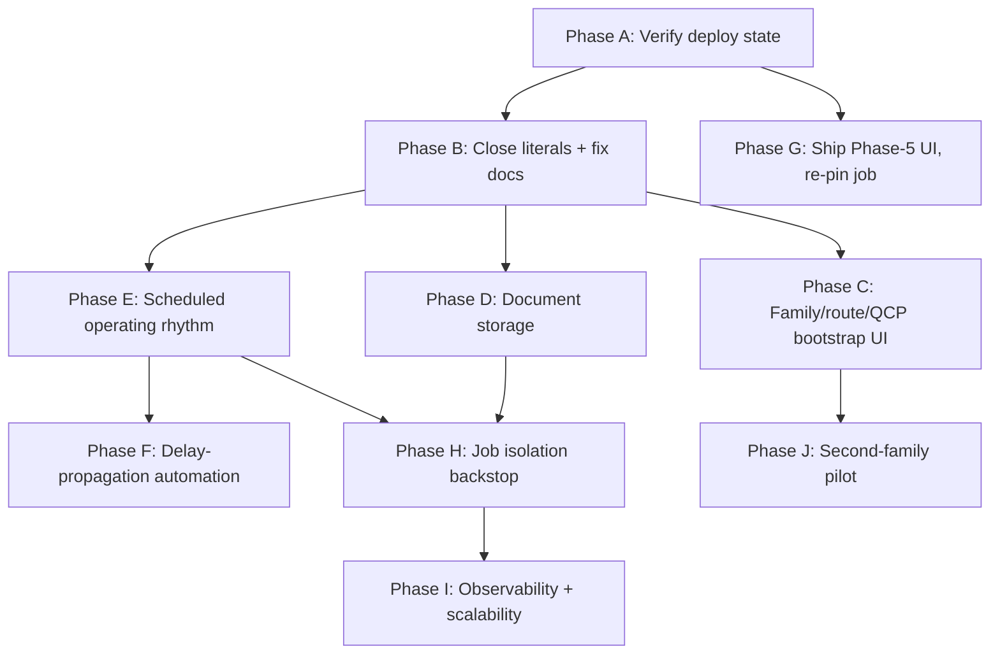

# 18 — DESPL MOS Implementation Roadmap

**Sequencing principle (per the brief, and per this blueprint's own conservative REBUILD finding in `17`):** preserve strong foundations → remove architectural coupling → establish generic domain model gaps that remain → build missing MOS capabilities → migrate DESPL-320's remaining literals → validate with a second product/project. No big-bang rewrite — every phase below is additive or narrowly corrective on top of an already-sound architecture.

## Phase A — Verify & reconcile branch/deploy state
- **Objective:** know, with certainty, whether the `demo` branch (77 commits ahead of `main`, carrying Phases 0–5) is what's actually live on Railway.
- **Architectural changes:** none.
- **Database changes:** none.
- **Backend/frontend changes:** none — this is a verification task, not engineering.
- **Acceptance criteria:** a written confirmation of which branch Railway is currently deploying from, and a decision (merge `demo` → `main`, or explicitly hold) recorded.
- **Dependencies:** none — this blocks confident prioritization of everything else.
- **Risk if skipped:** every other phase's "already built" claim may be describing code nobody can currently see in production.

## Phase B — Close literal couplings + correct documentation drift
- **Objective:** remove the four remaining DESPL-320/family/department literals (`17` row 7) and fix two documentation-drift issues (CLAUDE.md invariant #2, PHASE-PROMPTS.md's false "already fixed" claim about `workspace/page.tsx`).
- **Architectural changes:** none — these are call-site fixes on an already-generic mechanism.
- **Database changes:** none.
- **Backend changes:** `workspace/page.tsx`'s `pilotJobId()` fallback (remove or make configurable per-tenant, not hardcoded to "DESPL-320"); `admin.read.ts:63` (parameterize by the family in view instead of hardcoding PRESSURE_VESSEL); `welding.service.ts:24` (resolve FABRICATION department by a configurable reference, not a literal).
- **Frontend changes:** `stage-names.ts` → derive from `TemplateProcess.name` in `seq` order for the job's own route (`07` §1) — this is the highest-visibility one, since it's the flagship Stage Spine UI.
- **Testing:** existing test suites already cover gating/RBAC negative cases; add a test asserting `/admin` durations screen works for a non-PRESSURE_VESSEL family once §Phase C exists (can stub with PIPE_SPOOL's provisional route).
- **Acceptance criteria:** grep for `"DESPL-320"`/`"PRESSURE_VESSEL"`/`"FABRICATION"` string literals in `src/` returns zero results outside test fixtures.
- **Dependencies:** Phase A (know what's actually live before changing it).
- **Risk:** low — narrow, well-understood fixes.

## Phase C — Family/route/QCP self-serve admin UI
- **Objective:** close the actual MOS gate (`06`) — an engineer can author a `ProductFamily`, `RouteTemplate`, and a first `QcpTemplate` without a developer.
- **Architectural changes:** none — the underlying mechanism (`ProcessTemplateVersion`, `RouteTemplateVersion`, `QcpTemplate` library rows) already exists and is correct; this is new admin UI + the missing service functions to create these three entities.
- **Database changes:** none required (schema already supports this); consider adding an `authoredByUserId`/`authoredAt` pair for provenance if not already covered by `AuditLog`.
- **Backend changes:** new service functions — `createProductFamily`, `createRouteTemplate` (+ version/step authoring), `createQcpTemplate` (author-from-nothing, not just clone-from-existing).
- **Frontend changes:** extend `/admin/templates` (which already handles clone-from-existing-family generically) with author-from-scratch flows for all three entities.
- **Testing:** the standing acceptance test from the ADR — *"if we won an identical heat exchanger tomorrow, what code changes?"* — becomes directly testable: author HEAT_EXCHANGER's family/route/QCP through the new UI with zero code changes.
- **Acceptance criteria:** `19`'s acceptance test #2.
- **Dependencies:** Phase B (literal couplings closed first, so a new family doesn't immediately hit the `admin.read.ts` PRESSURE_VESSEL wall).
- **Risk:** medium — this is genuinely new UI/service surface, not a fix, but it composes with an already-correct data model.

## Phase D — Document/file storage
- **Objective:** add the `Document` model and object-store integration (`12`).
- **Architectural changes:** one new bounded-context service (Document Service, `16` §2).
- **Database changes:** new `Document` model, migration.
- **Backend changes:** upload/download service functions, wired to Engineering (drawings), QC (certificates/evidence), MTC records.
- **Frontend changes:** upload UI at each linking point (drawing revision, QC execution, MTC record).
- **Testing:** upload/download round-trip, permission inheritance from owning entity, audit trail on upload.
- **Acceptance criteria:** a QC inspector can attach a certificate photo to a `QcpExecution` and it is retrievable, tenant-and-job-scoped, and audit-logged.
- **Dependencies:** none structural — can run in parallel with Phase C.
- **Risk:** low — additive, well-precedented pattern (sibling prototype already uses S3-compatible storage).

## Phase E — Scheduled operating rhythm
- **Objective:** replace manual digest button and lazy alert scan with a real scheduler.
- **Architectural changes:** add a lightweight cron/queue (BullMQ/Redis, per CLAUDE.md's own named fallback).
- **Database changes:** none required beyond what `Notification`/digest models already have.
- **Backend changes:** move `publishDigest` to a scheduled job; move overdue/aged-hold-point detection from lazy page-load scan to a scheduled reconciliation job.
- **Testing:** verify digest fires on schedule in a staging environment; verify alert reconciliation catches a synthetically-aged hold point without a page load triggering it.
- **Acceptance criteria:** the daily digest arrives without anyone clicking "Send now"; an overdue stage generates an alert within a bounded time window regardless of page traffic.
- **Dependencies:** none structural.
- **Risk:** low-medium — first infrastructure dependency (Redis) the system would take on; size accordingly.

## Phase F — Delay-propagation automation
- **Objective:** auto-suggest (not auto-apply) a reschedule when a delay is filed (`09` §3).
- **Architectural changes:** none — composes `fileDelayReason` with the existing `applyDurationOverride`/CPM recompute path.
- **Backend changes:** on delay-reason filing, compute the would-be reschedule and surface it as a pending suggestion; Production Head/Admin applies with one click (still audited, still requiring the existing `OVERRIDE_REASON_REQUIRED` discipline).
- **Acceptance criteria:** `19` acceptance test #7.
- **Dependencies:** Phase E (shares scheduler infrastructure if the suggestion computation is deferred rather than synchronous).
- **Risk:** low — the CPM recompute path is already proven; this changes *who/what triggers it*, not the computation itself.

## Phase G — Ship Phase-5 dispatch/NCR/paint UI; re-pin a real job
- **Objective:** the already-built (service-layer-only) dispatch/NCR/paint work gets a UI, and DESPL-320 (or the next real job) is re-pinned to the template version that actually gates on it.
- **Backend changes:** none — service layer is already tested and committed.
- **Frontend changes:** dispatch batch/release/record UI, packing UI.
- **Acceptance criteria:** a unit can be packed, released, and dispatched through the UI, with QC/NCR status genuinely gating dispatch (closing the one-directional gating gap noted in `08`/audit §16).
- **Dependencies:** Phase A (confirm this code is even live before building UI on top of it).
- **Risk:** low — UI work on top of tested, committed service logic.

## Phase H — Job-level isolation backstop + widen cross-tenant test sweep
- **Objective:** close the data-architecture gap in `15` §4.
- **Database changes:** job-scoped RLS policy or view-based enforcement.
- **Testing:** expand `cross-tenant.test.ts`/`authz.test.ts` beyond the current four hand-picked entry points toward a systematic sweep.
- **Acceptance criteria:** a job-scoped RLS policy exists and a negative test proves cross-job reads are refused even when application code "forgets" to filter.
- **Dependencies:** none structural — can run in parallel with C/D/E.
- **Risk:** medium — RLS policy changes touch every query path; needs careful staging rollout.

## Phase I — Observability + scalability fixes
- **Objective:** structured logging, error tracking, the named N+1 fix, pagination on the 9 identified list-shaped services.
- **Dependencies:** none structural.
- **Risk:** low — well-understood, incremental work; the team's own code comments already name every fix needed.

## Phase J — Second product-family pilot
- **Objective:** prove Phase C's bootstrap UI for real, using `PIPE_SPOOL` (closest — a real route already exists, only durations and a QCP are missing).
- **Acceptance criteria:** `19`'s multi-project acceptance test — Project A (Pressure Vessel) and Project B (Pipe Spool) run simultaneously with independent workflows, schedules, BOMs, QC, and no cross-contamination of product-specific assumptions.
- **Dependencies:** Phase C.
- **Risk:** this is the real test of the whole MOS thesis — treat any friction found here as a first-class finding, not a bug to quietly patch.

## Sequencing diagram

## Priority summary (P0/P1/P2 roadmap)

- **P0:** Phase A (deploy verification), the documentation-drift half of Phase B.
- **P1:** the literal-coupling half of Phase B, Phase C (family bootstrap), Phase D (documents).
- **P2:** Phase E (operating rhythm), Phase H (isolation backstop), Phase I (observability/scalability), procurement vendor/PO fields.
- **P3:** Phase F (delay automation), Phase G (dispatch UI), KPI consolidation, equipment dashboard, portfolio due-this-week rollup.

**First development phase, concretely:** Phase A + the documentation-drift corrections in Phase B — both are cheap, both directly address this audit's two highest-leverage findings (branch/deploy uncertainty and a standing-rule violation the team's own process didn't catch), and both should happen before any new feature work is prioritized on top of an architecture whose live state isn't yet confirmed.

---
*Sources: consolidated from `01`–`17`, `docs/DESPL_MOS_FORENSIC_AUDIT.md` §46–§49, verified `railway.json`, `CLAUDE.md`, git branch state.*
